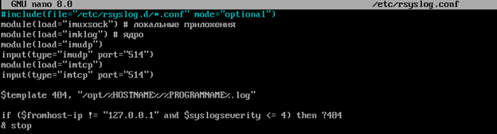
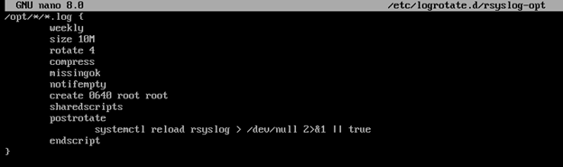
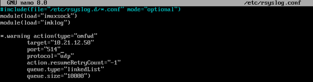

# SuroTools

> [!NOTE]
> ⚙️ Данный репозиторий предназначен для системных администраторов и инженеров, работающих с Linux‑системами. Он объединяет инструменты, типовые конфигурации и сопроводительную документацию.
> 
> ⚙️ Основная цель — создать единое пространство для хранения и автоматизации ключевых операционных решений, упрощая повседневную работу с Linux.
> 
> ⚙️ Часть конфигураций была разработана мной, другие - собраны из открытых источников, проверены и адаптированы для практического использования.


---

<details>
<summary>🐧 ALT Linux</summary>

<details>
<summary>🛠️🐧JEOS</summary>
    
После установки сего шедевра отечественного айти-прома первым делом нужно поставить нужные пакеты для комфортной работы - потому что даже автодополнение команд в этом дистрибутиве является опциональной, недостижимой мечтой, фичей уровня «Enterprise Deluxe Edition» :)))))

```bash
apt-get update
apt-get install bash-completion etcnet-full iptables nano sudo wget
```
    
</details>
    
<details>
<summary>🔀Настройка маршрутизации</summary>

<details>
<summary>ip_forward</summary>

net.ipv4.ip_forward позволяет системе работать как маршрутизатор - пересылать пакеты между сетевыми интерфейсами.

```bash
vim /etc/net/sysctl.conf
net.ipv4.ip_forward=1 #Меняем 0 на 1
vim /etc/sysctl.conf
net.ipv4.ip_forward=1
```

Перезагрузка sysctl

```bash
sysctl -p
```

</details>
    
<details>
<summary>iptables</summary>

iptables — это фаервол, который фильтрует и управляет сетевым трафиком на основе правил, решая, что пропустить, а что заблокировать.

Базовые команды iptables:

```bash
# Очистка старых правил
iptables -F
iptables -t nat -F
```

Сохранение настроек:

```bash
iptables-save >> /etc/sysconfig/iptables
systemctl enable iptables
```

Настройка правил на примере коммутатора:


```bash
iptables -t nat -A POSTROUTING -o <интерфейс с выходом на интернет> -j MASQUERADE
iptables -A	FORWARD	-i <интернет> -o <внут. инт> -j ACCEPT
iptables -A	FORWARD	-i <внут. инт> -o <интернет> -n state --state ESTABLISHED,RELATED -j ACCEPT
```

Безопасная настройка iptables:

```bash
iptables -t nat -A POSTROUTING -s <внут. ip сеть/маска> -o <интерфейс с выходом на интернет> -j MASQUERADE
iptables -A	FORWARD	-i <интернет> -o <внут. инт>  -s <внут. ip сеть/маска> -j ACCEPT

# Пример
iptables -t nat -A POSTROUTING -s 192.168.1.0/24 -o ens33 -j MASQUERADE
iptables -A	FORWARD	-i ens33 -o ens37 -s 192.168.1.0/24 -j ACCEPT
```

>iptables -t nat -A POSTROUTING -o <интерфейс с выходом на интернет> -j MASQUERADE - Прячет все внутренние компьютеры за своим внешним IP (Маскарадинг).
>
>iptables -A	FORWARD	-i <интернет> -o <внут. инт> -j ACCEPT - Позволяет внутренним компьютерам ходить в интернет.
>
>iptables -A	FORWARD	-i <внут. инт> -o <интернет> -n state --state ESTABLISHED,RELATED -j ACCEPT - Пропускает обратно только "ответы" на их запросы, повышая безопасность.

Настройка iptables после настройки DHCP

```bash
iptables -A INPUT -i <инт> -p udp -j ACCEPT
iptables -A INPUT -i <инт> -p tcp -j ACCEPT
```

</details>

<details>
<summary>DHCP</summary>

Установка DHCP-сервера

### Настройка сервера

```bash
apt-get install dhcp-server
```
Настройка /etc/dhcp/dhcpd.conf

```bash
default-lease-time 3600;
max-lease-time 86400;
authoritative;

subnet 10.21.211.0 netmask 255.255.255.0 {
    range 10.21.211.10 10.21.211.230;
    option routers 10.21.211.1;
    option subnet-mask 255.255.255.0;
    option broadcast-address 10.21.211.255;
    option domain-name "example.local";
    option domain-name-servers 192.168.1.1, 8.8.8.8;
}
```

> default-lease-time 3600; - время аренды по умолчанию (1 час)
>
> max-lease-time 86400; - максимальное время аренды (24 часа)
>
> authoritative; - сервер является авторитетным для данной сети
>
> subnet 10.21.211.0 netmask 255.255.255.0 - определение подсети
>
> range 10.21.211.10 10.21.211.230; - диапазон выдаваемых IP-адресов
>
> option routers 10.21.211.1; - шлюз по умолчанию
>
> option subnet-mask 255.255.255.0; - маска подсети
>
> option broadcast-address 10.21.211.255; - широковещательный адрес
>
> option domain-name "example.local"; - домен
>
> option domain-name-servers 192.168.1.1, 8.8.8.8; - адрес домена

Проверка конфигурации

```bash
dhcpd -t -cf /etc/dhcp/dhcpd.conf
```

Создание и настройка /etc/default/isc-dhcp-server

```bash
#DHCP_CONF=/etc/dhcp/dhcpd.conf
#DHCP_PID=/var/run/dhcpd.pid
#DHCP_OPTS="-4"
INTERFACEv4="<инт, который будет раздавать ip>"
INTERFACEv6=""
```

Если DHCP не заработает - то расскомментируете эти строчки

> DHCP_CONF=/etc/dhcp/dhcpd.conf - путь к основному конфигурационному файлу
>
> DHCP_PID=/var/run/dhcpd.pid - путь к файлу PID-процесса
>
> DHCP_OPTS="-4" - опции запуска (работа только с IPv4)
>
> INTERFACEv4="ens34" - интерфейс для IPv4
>
> INTERFACEv6="" - интерфейс для IPv6 (пусто - отключено)

Запускаем и добавляем в автозапуск dhcpd

```bash
systemctl start dhcpd && systemctl enable dhcpd
```

### Настройка клиента 

```bash
dhcpcd
```

</details>
  
<details>
<summary>Настройка портов и маршрута</summary>

### Настройка интерфейса

❗ Интерфейсы в виртуальную машину добавляем по одному.

>Потому что если накидать сразу пять - потом начнётся великий квест под названием:
>
>“А кто из вас, ребята, ens36?”
>
>Один окажется внутренней сетью, другой мостом, третий вообще зачем-то к Wi-Fi подключён…
>
>И вот ты стоишь посреди ip a, как градоначальник на развалинах, и думаешь - зачем я это сделал?..
>
>Так что добавляем по одному интерфейсу, настраиваем, проверяем, подписываем - и живём спокойно.
>
>Всё как в нормальной инфраструктуре: порядок, последовательность, и никакой магии:)

```bash
mkdir /etc/net/ifaces/ens34/
cp /etc/net/ifaces/ens33/options /etc/net/ifaces/ens34/
```
Если папка ifaces пустая, то берем конфиг options отсюда

```bash
BOOTPROTO=static
TYPE=eth
CONFIG_IPV4=yes
```
В конфигурации ipv4address пишите ip ❗❗❗ *с маской!!!* ❗❗❗

Поднимаем интерфейс

```bash
ifup ens34
```
Или перезапускаем network

```bash
systemctl restart network
```

### Настройка шлюза

```bash
vim /etc/net/ifaces/ens34/ipv4route
```

```bash
default via <ip роутера>
```

Если по какой-то причине шлюз не хочет вставать - решаем эту проблему до первой перезагрузки:)

```bash
#Добавляем шлюз
ip route add default via 192.168.1.1
#Удаляем шлюз
ip route del default via 192.168.1.1
```

</details>

<details>
<summary>VLAN</summary>

Создаём каталог в интерфейсах

```bash
mkdir /etc/net/ifaces/ens33.XX # где XX - номер vlan
```

Создаем файлы ipv4address и options

```bash
touch /etc/net/ifaces/ens33.XX/ipv4address
touch /etc/net/ifaces/ens33.XX/options
```

Конфигурация options

```bash
TYPE=vlan
HOST=ens33
VID=XX
DISABLED=no
BOOTPROTO=static
```

В конфигурации ipv4address пишите ip ❗❗❗ *с маской!!!* ❗❗❗

</details>

<details>
<summary>GRE туннель</summary>

GRE — это протокол для создания виртуальных точка-точка туннелей, который инкапсулирует один IP-пакет внутри другого, позволяя соединять удалённые сети через интернет.

Создаем каталог gre1 и конфигурируем options

```bash
mkdir /etc/net/ifaces/gre1
vim /etc/net/ifaces/gre1/options
```

```bash
TYPE=iptun
TUNTYPE=gre
TUNLOCAL=<внешний ip роутера, с которого настраиваете>
TUNREMOTE=<внешний ip удаленного роутера>
TUNOPTIONS='ttl 64'
TUNTTL=64
TUNMTU=1476
```

Настраиваем IP турренля

```
nano /etc/net/ifaces/gre1/ipv4address

10.10.10.1/30 #к примеру
```

</details>

<details>
<summary>FRR</summary>

FRR (Free Range Routing) - это набор демонов, который превращает обычный сервер в маршрутизатор, будто он всегда этим и мечтал быть. Поддерживает BGP, OSPF и другую сетевую магию, работает быстро и запускается почти везде. Отличный способ не покупать дорогую железку и при этом выглядеть профи.

Установка

```bash
apt-get install frr
systemctl enable --now frr
```

### Настройка OSPF

Чтобы начать настраивать OSPF, сначала подружите ваши роутеры через GRE-туннели (см. сверху). Без него OSPF просто не знает, куда идти и обижается :(

Входим в оболочку
```bash
vtysh
```

Базовая настройка OSPF

```vtysh
conf
router ospf
    router-id <ID роутера>
    network <IP вашего туннеля> area 0.0.0.0
    network <IP-ики вашей внутренней сети> area 0.0.0.0
    ...
    network <IP-ики вашей внутренней сети> area 0.0.0.0
do wr
```

MD5-аутентификация в OSPF

```vtysh
interface <инт>
    ip ospf authentication message-digest
    ip ospf message-digest-key 1 md5 <пароль>
do wr
```

Проверка работы OSPF

```vtysh
show ip ospf neighbor // проверка соседей
show ip ospf database // проверка lsa
```

</details>


<details>
<summary>Статическая трансляция портов (на основе iptables)</summary>

```bash
iptables -t nat -A PREROUTING -p tcp -i <внешний_интерфейс> --dport <порт_внешний> -j DNAT --to-destination <ip_сервера>:<порт_внутренний>
iptables -A FORWARD -p tcp -d <ip_сервера> --dport <порт_внутренний> -j ACCEPT
```

</details>

</details>

<details>
<summary>📦 Установка и настройка ПО</summary>
    
<details>
<summary>Драйвера VMware</summary>

‼️ Без драйверов VMware вы не сможете копировать команды между вашим компьютером и виртуальной машиной!
    
```bash
apt-get install open-vm-tools open-vm-tools-desktop xrandr
systemctl enable vmtoolsd
systemctl start vmtoolsd
```
> open-vm-tools — базовые функции (общая папка, время, пр.)
>
> open-vm-tools-desktop — автоматическое разрешение экрана, мышь, графика
>
> xrandr — утилита для управления разрешением (на случай ручной настройки)
    
</details>

<details>
<summary>rsyslog</summary>

rsyslog — это система, которая собирает, фильтрует и перенаправляет логи (журналы событий) в нужные места.

Устанавливаем на клиент и на сервер

```bash
apt-get install rsyslog logrotate
```

### Настройка сервера

Настройка конфига в /etc/rsyslog.conf



```bash
#include(file="/etc/rsyslog.d/*.conf" mode="options1") 

module(load="imuxsock")
module(load="imklog")
module(load="imudp")
input(type="imudp" port="514")
module(load="imtcp")
input(type="imtcp" port="514")

$template 404, "/opt/%HOSTNAME%/%PROGRAMNAME%.log"

if ($fromhost-ip != "127.0.0.1" and $syslogseverity <= 4) then ?404
& stop 
```

>#include(file="/etc/rsyslog.d/*.conf" mode="optional")  - ЗАКОММЕНТИРОВАНО - подключение дополнительных конфигов
>
>module(load="imuxsock") - Загрузка модуля для Unix-сокетов (локальные приложения)
>
>module(load="imklog") - Загрузка модуля для логов ядра
>
>module(load="imudp") - Загрузка UDP-модуля
>
>input(type="imudp" port="514") - Прослушивание syslog-сообщений по UDP на порту 514
>
>module(load="imtcp") - Загрузка TCP-модуля
>
>input(type="imtcp" port="514") - Прослушивание syslog-сообщений по TCP на порту 514
>
>$template 404, "/opt/%HOSTNAME%/%PROGRAMNAME%.log" - Шаблон для именования файлов логов
>
>if ($fromhost-ip != "127.0.0.1" and $syslogseverity <= 4) then ?404 - Правило фильтрации: если IP отправителя не 127.0.0.1 и уровень серьезности <= 4 (warning)
>
>& stop - Остановка дальнейшей обработки для этих сообщений

P.S. 404 — это произвольное имя шаблона, как переменная.

Создание каталогов для сбора логов клиентских машин

```bash
mkdir -p /opt/cli1
mkdir -p /opt/cli2
mkdir -p /opt/cli3
```
logrotate — это утилита для автоматического управления лог-файлами: их ротации, сжатия, архивирования и удаления по заданным правилам.

Настройка logrotate в /etc/logrotate.d/rsyslog-opt



```bash
/opt/*/*.log {
    weekly
    size 10M
    rotate 4
    compress
    missingok
    notifempty
    create 0640 root root
    sharedscripts
    postrotate
        systemctl reload rsyslog > /dev/null 2>&1 || true
    endscript
}
```
>/opt/*/*.log {                    - Применять правила ко всем .log файлам в поддиректориях /opt/
>
>weekly                        - Ротация раз в неделю
>
>size 10M                      - Или при достижении размера файла 10 МБ
>
>rotate 4                      - Хранить 4 архивных копии логов
>
>compress                      - Сжимать архивные копии gzip
>
>missingok                     - Не считать ошибкой отсутствие файлов логов
>
>notifempty                    - Не ротировать пустые файлы
>
>create 0640 root root         - Создавать новый файл лога с правами 640, владелец root:root
>
>sharedscripts                 - Выполнять скрипты только один раз для всей группы файлов
>
>postrotate                    - Начало блока команд после ротации
>
>systemctl reload rsyslog > /dev/null 2>&1 || true  - Перезагрузка rsyslog, подавление вывода
>
>endscript                     - Конец блока команд
}

Включение автозапуска и немедленный запуск

```bash
systemctl enable --now rsyslog logrotate
```

---

### Настройка клиента

Настройка конфига в /etc/rsyslog.conf



```bash
*.warning action(type="omfwd"
    target="10.21.12.50"
    port="514"
    protocol="tcp"
    action.resumeRetryCount="-1"
    queue.type="linkedList"
    queue.size="10000")
```

>*.warning action(type="omfwd"    - Правило для всех сообщений с уровнем warning и выше
>
>target="10.21.12.50"         - Адрес удаленного syslog-сервера
>
>port="514"                   - Порт для отправки
>
>protocol="tcp"               - Использование TCP протокола
>
>action.resumeRetryCount="-1" - Бесконечные попытки переподключения при обрыве
>
>queue.type="linkedList"      - Тип очереди - связный список
>
>queue.size="10000")          - Максимальный размер очереди - 10000 сообщений

Включение автозапуска и немедленный запуск

```bash
systemctl enable --now rsyslog
```

</details>

<details>
<summary>DNS сервер (bind)</summary>

Установка и включение bind

```bash
apt-get install bind bind-utils
```

Структура каталога bind

```bind
/etc/bind/
├── named.conf              # главный конфигурационный файл (include остальных)
├── options.conf            # глобальные параметры BIND
├── local.conf              # описание локальных зон (master/slave)
├── bind.keys               # корневые DNSSEC ключи (trust anchors)
├── rfc1912.conf            # стандартные служебные зоны (localhost и др.)
├── rfc1918.conf            # зоны для частных IP-адресов (RFC1918)
├── zone/                   # каталог файлов DNS-зон
│   ├── localhost           # прямая зона localhost
│   ├── localdomain         # прямая зона localdomain
│   ├── empty               # пустая зона-заглушка
│   ├── managed-keys.bind   # управляемые DNSSEC ключи
│   ├── managed-keys.bind.jnl # журнал изменений DNSSEC ключей
│   ├── slave/              # каталог slave-зон (получаемых с master)
│   └── 127.in-addr.arpa    # обратная зона loopback (127.0.0.1)
└── rndc.key                # ключ для управления BIND через rndc

```

<details>
<summary>Базовая настройка options.conf</summary>

```bash
listen-on { any; };
allow-query { any; };
allow-recursion { any; };
forwarders { 77.88.8.8; };
recursion yes;
```

</details>

<details>
<summary>Базовая настройка local.conf</summary>

Создание локальных зон

```bash
zone "ZONE_NAME" {                  # имя зоны (например: "domentest" или "100.168.192.in-addr.arpa")
    type TYPE;                       # тип зоны: master или slave
    file "ZONE_FILE_PATH";           # путь к файлу зоны (относительно /etc/bind/)
};
```

Пример прмяой зоны

```bash
zone "domentest" {
    type master;
    file "zone/domentest.db";
};

```

Пример обратной зоны

```bash
zone "11.168.192.in-addr.arpa" {
    type master;
    file "zone/100.168.192.in-addr.arpa";
};

```

</details>

<details>
<summary>Создание файлов зон</summary>

Берем шаблоны с localhost и 127.in-addr.arpa и назначаем владельца

```bash
cp /etc/bind/zone/{localhost,domaintest.db}
cp /etc/bind/zone/{127.in-addr.arpa,100.168.192.in-addr.arpa}

chown named:named /etc/bind/zone/domaintest.db
chown named:named /etc/bind/zone/100.168.192.in-addr.arpa
```

Шаблон файла зоны

```bash
$TTL <TTL_VALUE>              # Время жизни записей, например: 1D = 1 день
@   IN  SOA <PRIMARY_DNS>.<DOMAIN>. <ADMIN_EMAIL>. (
        <SERIAL_NUMBER>      ; Серийный номер зоны, формат YYYYMMDDnn
        <REFRESH>            ; Интервал обновления для slave (например: 1H)
        <RETRY>              ; Интервал повторной попытки при ошибке (например: 15M)
        <EXPIRE>             ; Время истечения у slave (например: 1W)
        <MINIMUM> )          ; Минимальное TTL для отрицательных ответов (например: 1D)

    IN  NS  <PRIMARY_DNS>.<DOMAIN>.   # Основной DNS-сервер зоны

<HOSTNAME_1>  IN  A  <IP_ADDRESS_1>
<HOSTNAME_2>  IN  A  <IP_ADDRESS_2>
... (добавляйте по необходимости)

<IP_LAST_OCTET>  IN  PTR  <HOSTNAME>.<DOMAIN>.

```

Прямая зона

```bash
$TTL 1D
@   IN  SOA dns.domaintest. root.domaintest. (
        20251217
        1H
        15M
        1W
        1D )

    IN  NS  dns.domaintest.

dns IN  A   192.168.100.50

```

Обратная зона зона

```bash
$TTL 1D
@   IN  SOA dns.domaintest. root.domaintest. (
        20251217
        1H
        15M
        1W
        1D )

    IN  NS  dns.domaintest.
10  IN  PTR dns.domaintest.

```

</details>

После настройки всех конфигов нужно проверить на ошибки и указать DNS-настройки системы в /etc/resolv.conf

```bash
nameserver 127.0.0.1
search domaintest
```

```bash
named-checkconf -z
```

Если всё правильно, запускаем и добавляем в автозагрузку

```bash
systemctl enable --now bind
```

</details>

<details>
<summary>dnsmasq</summary>

dnsmasq - это лёгкий сервис, который одновременно работает как простой DNS-сервер и DHCP-сервер. Он раздаёт IP-адреса устройствам в сети и может кешировать DNS-запросы, а также давать локальные доменные имена (например, home.lan). Его используют на домашних роутерах и небольших серверах, потому что он простой, быстрый и не требует сложной настройки.

> [!WARNING]
> У вас должен быть отключен BIND!!!

Заходим в /etc/dnsmasq.conf

```bash
# ————— DNS —————

# DNS будет работать на локальных интерфейсах
listen-address=127.0.0.1,192.168.0.1

# Домен
domain=home.lan

# Запрещаем пересылку запросов для наших локальных доменов
local=/home.lan/

# Включаем DNS-кеш
cache-size=1000

# Форвардинг DNS (провайдер, DoH, локальный резолвер)

server=77.88.8.8 

# Разрешаем использование /etc/hosts
expand-hosts

# Логи
log-queries
log-facility=/var/log/dnsmasq.log

# ————— A-записи ————— # (если отказываетесь от expand-hosts)
# address=/имя/IPv4

address=/router.home.lan/192.168.0.1
address=/server.home.lan/192.168.0.10
address=/nas.home.lan/192.168.0.20
address=/pc1.home.lan/192.168.0.50

# ————— DHCP —————

# Включаем DHCP-сервер
dhcp-range=192.168.0.50,192.168.0.150,12h

# Маска и шлюз
dhcp-option=3,192.168.0.1          # Default gateway
dhcp-option=6,192.168.0.1          # DNS — сам dnsmasq

# Домен для DHCP-клиентов
dhcp-option=15,home.lan

# ————— Безопасность —————

# Запрещаем интерфейсы, на которых dnsmasq не должен работать
#except-interface=lo
#except-interface=eth1

# Запуск от непривилегированного пользователя
user=nobody
group=nogroup

```

<details>
<summary>Таблица DHCP опций</summary>

|     Код | Название                         | Описание                        |
| ------: | -------------------------------- | ------------------------------- |
|0        | Pad                              | Пустой байт                     |
|       1 | Subnet Mask                      | Маска подсети                   |
|       2 | Time Offset                      | Смещение времени                |
|       3 | Router                           | Основной шлюз (Default Gateway) |
|       4 | Time Server                      | Сервер времени                  |
|       5 | Name Server                      | Сервер имён (несовр.)           |
|       6 | DNS Server                       | DNS-сервера                     |
|       7 | Log Server                       | Сервер журнала                  |
|       8 | Cookie Server                    | Сервер cookies (редкость)       |
|       9 | LPR Server                       | Принт-сервер                    |
|      10 | Impress Server                   | Старый print сервер             |
|      11 | RLP Server                       | Сервер RLP                      |
|      12 | Hostname                         | Имя клиента                     |
|      13 | Boot File Size                   | Размер загрузочного файла       |
|      14 | Merit Dump File                  | Dump-файл                       |
|      15 | Domain Name                      | Домен клиента                   |
|      16 | Swap Server                      | Swap-сервер                     |
|      17 | Root Path                        | Корневой путь                   |
|      18 | Extensions Path                  | Путь расширений                 |
|      19 | IP Forwarding                    | Разрешить форвардинг?           |
|      20 | Non-local Source Routing         | Маршрутизация?                  |
|      21 | Policy Filter                    | Фильтр политик                  |
|      22 | Max Datagram Reassembly          | Максимальная фрагментация       |
|      23 | Default TTL                      | TTL по умолчанию                |
|      24 | Path MTU Aging                   | Время устаревания MTU           |
|      25 | Path MTU Plateau Table           | Таблица MTU                     |
|      26 | MTU Interface                    | MTU интерфейса                  |
|      27 | MTU Subnet                       | MTU подсети                     |
|      28 | Broadcast Address                | Broadcast адрес                 |
|      29 | Trailer Encapsulation            | Trailer используется?           |
|      30 | ARP Timeout                      | Таймаут ARP                     |
|      31 | Ethernet Encapsulation           | Ethernet флаг                   |
|      32 | TCP Default TTL                  | TCP TTL                         |
|      33 | TCP Keepalive Interval           | Интервал keepalive              |
|      34 | TCP Keepalive Garbage            | Отправлять garbage?             |
|      35 | NIS Domain                       | NIS домен                       |
|      36 | NIS Server                       | NIS сервер                      |
|      37 | NTP Server                       | Сервер времени NTP              |
|      38 | Vendor Specific                  | Vendor-specific параметры       |
|      39 | NetBIOS Name Server              | WINS сервер                     |
|      40 | NetBIOS Dist Server              | WINS распределённый             |
|      41 | NetBIOS Node Type                | Тип узла NetBIOS                |
|      42 | NetBIOS Scope                    | Scope NetBIOS                   |
|      43 | Vendor Specific Info             | Данные производителя            |
|      44 | NetBIOS Name Server              | WINS                            |
|      45 | NetBIOS Dist Server              | WINS распредел.                 |
|      46 | NetBIOS Node Type                | B, P, M, H                      |
|      47 | NetBIOS Scope                    | Scope                           |
|      48 | X Window Font Server             | Шрифтовый X-сервер              |
|      49 | X Window Display Manager         | XDM сервер                      |
|      50 | Requested IP Address             | Клиент хочет IP                 |
|      51 | Lease Time                       | Время аренды                    |
|      52 | Option Overload                  | Доп. поля                       |
|      53 | DHCP Message Type                | Тип DHCP сообщения              |
|      54 | DHCP Server ID                   | IP DHCP сервера                 |
|      55 | Parameter Request List           | Запрос опций                    |
|      56 | Message                          | Сообщение                       |
|      57 | Max DHCP Message Size            | Макс. размер пакета             |
|      58 | Renewal Time                     | T1                              |
|      59 | Rebinding Time                   | T2                              |
|      60 | Vendor Class ID                  | ID класса                       |
|      61 | Client Identifier                | Идентификатор клиента           |
|      62 | Netware/IP Domain Name           | NetWare                         |
|      63 | Netware/IP Sub Options           | Подопции                        |
|      64 | NIS+ Domain                      | NIS+ домен                      |
|      65 | NIS+ Server                      | NIS+ сервер                     |
|      66 | TFTP Server Name                 | Адрес TFTP (PXE)                |
|      67 | Bootfile Name                    | Имя PXE-файла                   |
|      68 | Mobile IP Home Agent             | Mobile IP                       |
|      69 | SMTP Server                      | Почтовый сервер                 |
|      70 | POP3 Server                      | POP3                            |
|      71 | NNTP Server                      | Новости                         |
|      72 | WWW Server                       | Web-сервер                      |
|      73 | Finger Server                    | Finger                          |
|      74 | IRC Server                       | IRC                             |
|      75 | StreetTalk Server                | StreetTalk                      |
|      76 | STDA Server                      | StreetTalk Directory            |
|      77 | User Class                       | Класс пользователя              |
|      78 | SLP Directory Agent              | SLP                             |
|      79 | SLP Scope                        | SLP                             |
|  80–127 | Зарезервировано (IANA)           | —                               |
| 128–135 | Vendor Specific (PXE)            | PXE параметры BIOS/UEFI         |
| 136–254 | Разные расширения производителей | —                               |
|     255 | End                              | Конец списка опций              |


</details>

После этого запускаем dnsmasq

```bash
systemctl enable --now dnsmasq
```

P.S.

Параметр <code>expand-hosts</code> в dnsmasq позволяет не прописывать <code>address=</code> в конфигурации. Когда <code>expand-hosts</code> включён, dnsmasq автоматически создаёт DNS-записи на основе файла <code>/etc/hosts</code>, добавляя к ним локальный домен, указанный в параметре <code>domain</code>. Например, если в <code>/etc/hosts</code> записано <code>192.168.0.10 server</code>, а в dnsmasq задано <code>domain=home.lan</code>, то dnsmasq автоматически создаст записи <code>server</code> и <code>server.home.lan</code>, обе указывающие на IP 192.168.0.10. Поэтому A-записи через <code>address=</code> в таком случае не нужны - dnsmasq сам формирует полноценные локальные DNS-имена. Дополнительно, при включённом <code>localise-queries</code> генерируются и соответствующие PTR-записи для обратного разрешения. Использовать <code>address=</code> имеет смысл только тогда, когда нужно задать IP-адрес, отсутствующий в <code>/etc/hosts</code>, создать wildcard-запись или настроить перенаправление домена. Во всех остальных случаях <code>/etc/hosts + expand-hosts</code> полностью покрывают задачу локального DNS без необходимости прописывать каждую запись вручную.

</details>

<details>
<summary>Chrony</summary>

### Настройка сервера

```bash
apt-get install chrony
```

Идем в /etc/chrony.conf и в конфиге пишем:

https://www.ntp-servers.net/servers.html - сервера времени

```bash
server <адресс сервера времени> iburst     # iburst нужен для ускорения первоначальной синхронизации
allow 192.168.0.0/24   # замените на подсеть вашей сети
```

Добавляем в автозагрузку и запускаем

### Настройка клиента

В /etc/chrony.conf

```bash
server <ip сервера> iburst
```

Запускаем и проверяем:

```bash
chronyc sources -v
chronyc tracking
```

</details>

<details>
<summary>SAMBA</summary>

<details>
<summary>Настройка домена Samba Active Directory</summary>

### Настройка сервера

Устанавливаем необходимые пакеты

```bash
apt-get install -y task-samba-dc
```

Очищаем от первоначальных конфигов

```bash
rm -f /etc/samba/smb.conf
rm -rf /var/lib/samba
rm -rf /var/cache/samba
mkdir -p /var/lib/samba/sysvol
```

Настраиваем DNS сервер в /etc/resolf.conf

```bash
echo "nameserver 127.0.0.1" > /etc/resolv.conf
```

Создаем домен

```bash
samba-tool domain provision
```

Активируем и запускаем службу Samba

```bash
systemctl enable --now samba
```

Копируем сгенерированный файл настроек Kerberos

```bash
cp /var/lib/samba/private/krb5.conf /etc/krb5.conf
```

Проверяем на работоспособность

```bash
samba-tool domain info 127.0.0.1
host -t SRV _kerberos._udp.ad.team
host -t SRV _ldap._tcp.ad.team
host -t A srv-hq.ad.team
```

Получаем билет Kerberos и проверяем его наличие

```bash
kinit administrator@AD.TEAM
klist
```

### Настройка клинета

Устанавливаем пакеты для интеграции с Active Directory

```bash
apt-get install -y task-auth-ad-sssd
```

Активируем службы для работы с доменом

```bash
systemctl enable --now smb winbind sssd
```

В /etc/krb5.conf вписываем:

```bash
[libdefaults]
default_realm = AD.TEAM
dns_lookup_kdc = true
dns_lookup_realm = false
ticket_lifetime = 24h
renew_lifetime = 7d
forwardable = true

[realms]
AD.TEAM = {
    kdc = 192.168.11.67
    default_domain = ad.team
    admin_server = 192.168.11.67
}

[domain_realm]
.ad.team = AD.TEAM
ad.team = AD.TEAM
```

Настройка DNS

```bash
domain ad.team
nameserver 192.168.11.67
search ad.team
```

Присоединяемся к домену

```bash
net ads join -U administrator@AD.TEAM -S 192.168.11.67
su -
acc
```

Проверка

```bash
host srv-hq
host $(hostname)
```

После этого перезагружаемся

```bash
reboot
```

</details>

<details>
<summary>Создание системной группы и пользователя</summary>

Создать группу

```bash
sudo samba-tool group add <имя>
```

Создание пользователя

```bash
sudo samba-tool user create <имя>
```

Добавить пользователя в группу

```bash
sudo samba-tool group addmembers <имя группы> <имя пользователя>
```

Проверка, что пользователь создан и добавлен в группу

```bash
sudo samba-tool user list
```

```bash
sudo samba-tool group listmembers students
```

--

</details>

<details>
<summary>Полезные штучки</summary>

Ниже приведён полный набор команд для расширенной настройки домена Samba AD DC.

```bash
#############################
# 1. ПАРОЛЬНАЯ ПОЛИТИКА
#############################

# Отключить сложность паролей
sudo samba-tool domain passwordsettings set --complexity=off

# Минимальная длина пароля (1 для тестов)
sudo samba-tool domain passwordsettings set --min-pwd-length=1

# Максимальное время действия пароля (0 = не истекает)
sudo samba-tool domain passwordsettings set --max-pwd-age=0

# Минимальное время перед сменой (0 = отключено)
sudo samba-tool domain passwordsettings set --min-pwd-age=0

# Длина истории паролей (0 = можно повторять)
sudo samba-tool domain passwordsettings set --pwd-history-length=0
```

```bash
#############################
# 2. ПОЛИТИКА БЛОКИРОВКИ
#############################

# Порог блокировки (0 = блокировка отключена)
sudo samba-tool domain passwordsettings set --lockout-threshold=0

# Длительность блокировки, мин
sudo samba-tool domain passwordsettings set --lockout-duration=30

# Время сброса счётчика неудачных попыток
sudo samba-tool domain passwordsettings set --reset-count=30
```

```bash
#############################
# 3. ПОЛИТИКА KERBEROS
#############################

# Время жизни тикета (часы)
sudo samba-tool domain passwordsettings set --krb-ticket-lifetime=24

# Время обновления тикета (часы)
sudo samba-tool domain passwordsettings set --krb-renewal-lifetime=168   # 7 дней
```

```bash
#############################
# 4. ПОЛИТИКА УЧЁТНЫХ ЗАПИСЕЙ
#############################

# Сделать так, чтобы никто не должен менять пароль при первом входе
# (для всех новых пользователей уже не требуется смена)
# (для конкретного: samba-tool user setpassword user --must-change-at-next-login=no)

# Разрешить устаревшие (expired) пароли использовать для входа
sudo samba-tool domain passwordsettings set --store-plaintext-password=yes

# Разрешить пустые пароли (если сильно нужно)
# ВНИМАНИЕ! Использовать только в изолированных стендах
sudo samba-tool domain passwordsettings set --allow-plaintext-password=yes
```

```bash
#############################
# 5. ПОЛИТИКА АВТОРИЗАЦИИ ПО ВРЕМЕНИ
#############################

# Ограничение часов входа — отключено по умолчанию.
# Но для справки:
# sudo samba-tool user setexpiry <username> --expiry=<YYYYMMDDHHMMSS.0Z>

# Включить "пароль не истекает" по умолчанию для новых пользователей
# (нужно править smb.conf, но через samba-tool можно для каждого)
# Пример: sudo samba-tool user setexpiry user --noexpiry
```

```bash
#############################
# 6. ПАРАМЕТРЫ БЕЗОПАСНОСТИ ДОМЕНА
#############################

# Разрешить использование старых алгоритмов шифрования (NTLMv1/LM)
# (не рекомендовано, но иногда нужно для старых устройств)
sudo samba-tool domain passwordsettings set --allow-microsecond-timestamps=yes

# Включить поддержку слабых клиентов:
sudo samba-tool domain passwordsettings set --allow-weak-crypto=yes
```

```bash
#############################
# 7. ПОЛИТИКА TGT/TGS (KRB5)
#############################

# Maximally permissive Kerberos policy
sudo samba-tool domain passwordsettings set --krb-policy-flags=0x00000000
```

```bash
#############################
# 8. ПАРАМЕТРЫ АУДИТА И ЛОГОВ
#############################

# Повышение детализации логов AD
sudo samba-tool domain level show

# Логи Samba:
# sudo smbcontrol all debug 3
# sudo smbcontrol all debug 10   # максимум
```

```bash
#############################
# 9. ПАРАМЕТРЫ ДОМЕННОГО ФУНКЦИОНАЛЬНОГО УРОВНЯ
#############################

# Узнать уровень:
sudo samba-tool domain level show

# Установить максимально доступный уровень:
sudo samba-tool domain level raise --domain-level=2008_R2
sudo samba-tool domain level raise --forest-level=2008_R2
```

```bash
#############################
# 10. ПОЛНАЯ ПРОВЕРКА ТЕКУЩЕЙ ПОЛИТИКИ
#############################

sudo samba-tool domain passwordsettings show

```

</details>

</details>

<details>
<summary>OpenSSH</summary>

OpenSSH - это стандартный инструмент для безопасного удалённого подключения к серверу. Он шифрует весь трафик, защищая ваши данные от посторонних глаз, и позволяет управлять сервером с любого устройства.

Устанавливаем на устройства, куда нужно

```bash
sudo apt install openssh-common
sudo systemctl enable --now sshd
```

Редактируем файл /etc/openssh/sshd_config на машине, к которой будем подключаться

```bash
PasswordAuthentication yes
// По желанию можете поменять port, AllowUsers (белый список) и так далее.
```

<details>
<summary>Подключение по ключу</summary>

Генерируем с клиентской машины(откуда будем подключаться) ключ

```bash
ssh-keygen
```

Копируем публичный ключ на машину, к которой будем подключаться

```bash
ssh-copy-id -i ~/.ssh/id.pub пользователь@сервер
```

Настройка sshd_config 

```bash
PubkeyAuthentication yes
AuthorizedKeysFile .ssh/authorized_keys
PasswordAuthentication yes  # можно отключить после проверки ключей
```

--

</details>

Создаем и добавляем пользователя

```bash
useradd -mg users -G wheel <имя пользователя> 
passwd <имя пользователя> 
```

Расскомментируем строчку в /etc/sudoers

```bash
%wheel ALL=(ALL:ALL) ALL
```
После настройки перезагружаем sshd
```bash
sudo systemctl restart sshd
```

</details>

<details>
<summary>mdadm</summary>
    
mdadm — это утилита для создания, управления и мониторинга программных RAID-массивов на Linux. Она поддерживает все популярные уровни RAID: 0, 1, 4, 5, 6, 10 и т. д.

Основные функции mdadm:

>Создание RAID-массивов (--create)
>
>Добавление/удаление дисков (--add, --remove)
>
>Проверка состояния массива (--detail, /proc/mdstat)
>
>Сборка существующих массивов (--assemble)
>
>Мониторинг с уведомлением (--monitor)

<details>
<summary>Команды для разных уровней RAID</summary>

| RAID    | Команда шаблона                                                                           |
| ------- | ----------------------------------------------------------------------------------------- |
| RAID 0  | `mdadm --create /dev/md0 --level=0 --raid-devices=2 /dev/sdb /dev/sdc`                    |
| RAID 1  | `mdadm --create /dev/md0 --level=1 --raid-devices=2 /dev/sdb /dev/sdc`                    |
| RAID 5  | `mdadm --create /dev/md0 --level=5 --raid-devices=3 /dev/sdb /dev/sdc /dev/sdd`           |
| RAID 6  | `mdadm --create /dev/md0 --level=6 --raid-devices=4 /dev/sdb /dev/sdc /dev/sdd /dev/sde`  |
| RAID 10 | `mdadm --create /dev/md0 --level=10 --raid-devices=4 /dev/sdb /dev/sdc /dev/sdd /dev/sde` |

</details>

Допустим, у нас есть 3 диска и мы хотим сделать RAID-5

```bash
sudo mdadm --create --verbose /dev/md0 --level=5 --raid-devices=3 /dev/sdb /dev/sdc /dev/sdd
```

>/dev/md0 — имя создаваемого массива
>
>--level=5 — уровень RAID (0, 1, 5, 6, 10…)
>
>--raid-devices=N — количество дисков
>
>Список дисков — /dev/sdX

Проверка состояния RAID

```bash
cat /proc/mdstat
sudo mdadm --detail /dev/md0
```

Создание файловой системы

```bash
sudo mkfs.ext4 /dev/md0
```

Монтирование

```bash
sudo mkdir /mnt/raid5
sudo mount /dev/md0 /mnt/raid5
```

Чтобы RAID монтировался автоматически при загрузке, добавьте запись в /etc/fstab

```bash
/dev/md0   /mnt/raid5   ext4   defaults   0 0
```

Сохранение конфигурации mdadm

```bash
sudo mdadm --detail --scan >> /etc/mdadm.conf
```

</details>

<details>
<summary>OpenSSL CA</summary>

OpenSSL CA используется для создания и управления собственным центром сертификации, что позволяет самостоятельно выпускать, подписывать и проверять цифровые сертификаты для защиты внутренних сетевых служб и шифрования соединений.

### Настройка сервера

Создадим директорию которую будем использовать в качестве корневой для Центра Сертификации

```bash
mkdir /ca
```
Припомощи утилиты "openssl" найдём путь где расположен конфигурационный файл

```bash
openssl ca
```

Сделаем резервную копию данного конфигурационного файла перед его редактированием

```bash
cp /var/lib/ssl/openssl.{cnf,cnf.backup}
```

Переходим к редактированию конфигурационного файла "openssl.cnf":

* первым делов в секции [ CA_default ] правим параметр определяющий корневую директорию CA:


```bash
dir     =ca
```

После смены корневой директории CA - необходимо создать определённую структуру директорий, описанную в секции [ CA_default ]

```bash
cd /ca
mkdir certs newcerts crl private
touch index.txt
echo -n '00' > serial   # опция "-n" для того, чтобы небыло никакого пробела и перевода строки
```

Возвращаемся к редактированию конфигурационного файла, далее в секции [ CA_default ] - определяем в качестве политики по умолчанию «policy = policy_anything», так мы принимаем все, что угодно, и требуем только CN (Common Name)

```bash
policy = policy_anything
commonName = supplied
```

Далее добавляем некоторые необходимые значения по умолчанию для CA в секции [ req_distinguished_name ]:

* Например наш CA должен удовлетворять следующим требованиям: C=RU, O=champ.first, CN=champ.first RootCA

Здесь говорится, что описание названия страны - "Название страны (2-буквенный код — RU)" и запись для названия организации

```bash
countryName_default    = RU
0.organizationName_defauIt    = champ.first
```

Далее добавляем расширения для самого CA в секции [ v3_ca ]:

```bash
basicConstraints = CA:true
```

Указываем, что данный сертификат выпущенный при использовании расширения (-extensions v3_ca ) может быть корневым CA

Генерируем открытый и закрытый ключ для CA

Значения C=RU и O=champ.first — автоматически подставляются из конфигурационного файла, также не забываем указать CN (т. к. он у всех разный), в случае когда поля необходимо оставить пустыми — ставим «.»

```bash
openssl req -nodes -new -out cacert.csr -keyout private/cakey.pem -extensions v3_ca
```

Прочитать содержимое сертификата:

```bash
openssl x509 -text -noout -in cacert.pem | less
```

### Настройка клиента

Для добавления корневого сертификата выпущенного нашим Центром Сертификации - нееобходимо поместить данный сертификат в директории в зависимости от дистрибутива:

   * на базе deb /usr/local/share/ca-certificates, после чего выполнить команду update-ca-certificates

   * на базе rpm /etc/pki/ca-trust/source/anchrors, после чего выполнить команду update-ca-trust extract

P.S. сертификаты должны иметь расширение ".crt"

</details>

<details>
<summary>FreeIPA</summary>


## ⚠️ Важно!

 В файле hostname не должно быть заглавных букв!

<details>
<summary>С интегрированным DNS</summary>

### Настройка сервера

Установим пакет FreeIPA с интегрированным DNS-сервером:

```bash
apt-get install -y freeipa-server-dns
```

Запускаем интерактивную установку FreeIPA

```bash
ipa-server-install
```


1 - отвечаем yes на вопрос, нужно ли сконфигурировать DNS-сервер BIND;
2, 3, 4 - нужно указать имя узлаЮ на котором будет установлен сервер FreeIPA, доменное имя и пространство Kerberos;

* Эти имена нельзя изменить после завершения установки!

Далее необходимо проверить информацию о конфигурации и подтвердить ответив yes

Проверяем запущенные службы

```bash
ipactl status
```

Получаем билет kerberos

```bash
kinit admin
klist
```

Создаем пользователя и группу

```bash
ipa user-add login --first=Name --last=Name --password
ipa group-add group_name
```
Добавление пользователя в группу

```bash
ipa group-add-member group_name --users=username
```

### Настройка клиента

Устанавливаем пакеты

```bash
apt-get install -y freeipa-client zip
```

Запускаем скрипт настройки клиента

```bash
ipa-client-install --mkhomedir --enable-dns-updates
```

Также после ввода в домен - клиент автоматически доверяет интегрированному корневому центру 

</details>

<details>
<summary>Без интегрированного DNS</summary>

### Настройка сервера

Установим пакет FreeIPA без DNS-сервера:

```bash
apt-get install -y freeipa-server
```

Запускаем интерактивную установку FreeIPA

```bash
ipa-server-install
```

Проверяем запущенные службы

```bash
ipactl status
```

Получаем билет kerberos

```bash
kinit admin
klist
```

Создаем пользователя и группу

```bash
ipa user-add login --first=Name --last=Name --password
ipa group-add group_name
```
Добавление пользователя в группу

```bash
ipa group-add-member group_name --users=username
```

1 - отвечаем no на вопрос, нужно ли сконфигурировать DNS-сервер BIND;

2, 3, 4 - нужно указать имя узла на котором будет установлен сервер FreeIPA, доменное имя и пространство Kerberos;

### Настройка клиента

Устанавливаем пакеты

```bash
apt-get install -y freeipa-client zip
```

Запускаем скрипт настройки клиента

```bash
ipa-client-install --mkhomedir --enable-dns-updates
```

</details>

</details>

<details>
<summary>База данных</summary>

<details>
<summary>MySQL</summary>

Устанавливаем пакет и включаем в автозагрузку

```bash
apt-get install -y MySQL-server
systemctl enable --now mysqld
```

Задаем пароль

```bash
mysql -u root
ALTER USER 'root'@'localhost' IDENTIFIED BY 'P@ssw0rd';
```

Разрешаем доступ к MySQL из сети

```bash
sed -i "s/skip-networking/#skip-networking/g" /etc/my.cnf.d/server.cnf
systemctl restart mysqld
```

Разрешаем доступ для пользователя "root" по сети с любого узла

```bash
mysql -u root -p

GRANT ALL PRIVILEGES ON *.* TO 'root'@'localhost';
UPDATE mysql.user SET host='%' WHERE user='root';
EXIT;

systemctl restart mysqld
```

Проверяем на сервере

```bash
SELECT user, HOST FROM mysql.user;
```

Удаленное подключение на клиенте

```bash
mysql -h <ip сервера> -u root -p
```

Создание БД

```bash
mysql -u root -p
CREATE DATABASE db01; # где db01 - имя создаваемой БД
```

Создание пользователя (знак процента означает, что пользователь может подключаться к серверу с любого хоста)

```bash
CREATE USER 'user01'@'%' IDENTIFIED BY 'P@ssw0rd';
```
Проверка существования БД и пользователя

```bash
SHOW DATABASES;
SELECT user, HOST FROM mysql.user;
```

</details>

<details>
<summary>MariaDB</summary>

Установка пакетов

```bash
apt-get install -y mariadb-server
systemctl enable --now mariadb
```

Задаем пароль root

```bash
mariadb -u root
ALTER USER 'root'@'localhost' IDENTIFIED BY 'P@ssw0rd';
```

Разрешаем доступ к MySQL из сети

```bash
sed -i "s/skip-networking/#skip-networking/g" /etc/my.cnf.d/server.cnf
systemctl restart mariadb
```
Разрешаем доступ для пользователя "root" по сети с любого узла

```bash
mariadb -u root -p

GRANT ALL PRIVILEGES ON *.* TO 'root'@'localhost';
UPDATE mysql.user SET host='%' WHERE user='root';
EXIT;

systemctl restart mysqld
```

Проверяем на сервере

```bash
SELECT user, HOST FROM mysql.user;
```

Удаленное подключение на клиенте

```bash
mariadb -h <ip сервера> -u root -p
```

Создание БД

```bash
mariadb -u root -p
CREATE DATABASE db01; # где db01 - имя создаваемой БД
```

Создание пользователя (знак процента означает, что пользователь может подключаться к серверу с любого хоста)

```bash
CREATE USER 'user01'@'%' IDENTIFIED BY 'P@ssw0rd';
```
Проверка существования БД и пользователя

```bash
SHOW DATABASES;
SELECT user, HOST FROM mysql.user;
```

</details>

<details>
<summary>PostgreSQL</summary>

Установка пакетов

```bash
apt-get install -y postgresql16-server
```

Создаем системные БД

```bash
/etc/init.d/postgresql initdb
```

Включаем и добавляем в автзагрузку 

```bash
systemctl enable --now postgresql
```

Разрешаем доступ к PostgreSQL из сети

```bash
vim /var/lib/pgsql/data/postgresql.conf
```

В конфигарционном файле находим строку "listen_addresses = 'localhost'" и приводи м  ее к следующему виду:

```bash
listen_addresses = '*'

systemctl restart postgresql
```

Для заведения пользователей и создания баз данных, необходимо переключиться в учётную запись "postgres"

```bash
psql -U postgres
```

Зададим пароль

```bash
ALTER USER postgres WITH ENCRYPTED PASSWORD 'P@ssw0rd';
```

Настраиваем парольную аутентификацию для удалённого доступа и приводим к следующему виду:

```bash
vim /var/lib/pgsql/data/pg_hba.conf
```

```bash
host    all    all    0.0.0.0/0    md5

systemctl restart postgresql
```

Создаем пользователей с правами на БД

```bash
psql -U postgres
```

```bash
CREATE DATABASE db01;
CREATE USER user01 WITH PASSWORD 'P@ssw0rd';
GRANT ALL PRIVILEGES ON DATABASE db01 to user01;
```

Проверка

```bash
SELECT datname FROM pg_database;
SELECT username, usersuper, usecreatedb FROM pg_catalog.pg_user;
```
И на клиенте

```bash
psql -U user01 db01
psql -U user01 -h <ip сервера> -d db01
```

</details>

</details>

<details>
<summary>NFS</summary>

Устанавливаем пакеты для NFS сервера

### Настройка сервера 

```bash
apt-get install -y nfs-server nfs-utils
```

Создаём директорию для общего доступа /raid/nfs

```bash
mkdir /raid/nfs
```

Назначаем права на созданную директорию

```bash
chmod 777 /raid/nfs
```

Редактируем файл /etc/exports

```bash
vim /etc/exports

/raid/nfs    <клиентская сеть>(rw,no_root_squash)
```

Экспортируем файловую систему, указанную выше в /etc/exports

```bash
exportfs -arv

systemctl enable --now nfs-server
```

### Настройка клиента

Выполняем установку пакетов для NFS 

```bash
apt-get install -y nfs-utils nfs-clients
```

Создадим директорию для монтирования общего ресурса

```bash
mkdir /mnt/nfs 
```

Задаём права на созданную директорию:

```bash
chmod 777 /mnt/nfs 
```

Настраиваем автомонтирование общего ресурса через fstab

```bash
vim /etc/fstab

<ip сервера>:/raid/nfs /mnt/nfs    nfs    default    0    0
```

Выполняем монтирование общего ресурса

```bash
mount -av
df -h # проверка
```

</details>

<details>
<summary>ansible</summary>

### Настройка сервера

Установка пакетов ansible и sshpass

```bash
apt-get install –y ansible sshpass 
```

Приведём файл инвентаря ansible к следующему виду, отредактировав конфигурационный файл по пути /etc/ansible/hosts

```bash
[Servers]
HQ-SRV ansible_host=192.168.100.2
[Routers]
HQ-RTR ansible_host=10.10.10.1
BR-RTR ansible_host=192.168.0.1
[Clients]
HQ-CLI ansible_host=192.168.200.2
[Servers:vars]
ansible_user=sshuser
ansible_password=P@ssw0rd
ansible_port=2026
[Routers: vars]
ansible_user=net_admin
ansible_password=P@ssw0rd
ansible_connection=network_cli
ansible_network_os=ios
[Clients:vars]
ansible_user=user
ansible_password=resu
[all:vars]
ansible_python_interpreter=/usr/bin/python3
```
> ansible_host           — IP-адрес или DNS-имя хоста для подключения\
> 
> ansible_user           — пользователь для SSH-подключения
> 
> ansible_password       — пароль для подключения
> 
> ansible_port           — порт SSH (по умолчанию 22)
> 
> ansible_become         — включение повышения привилегий (yes/no)
> 
> ansible_become_user    — пользователь, под которым выполняются команды через sudo
> 
> ansible_become_method  — метод повышения привилегий (sudo, su, pbrun, etc.)
> 
> ansible_connection     — тип подключения (ssh, network_cli, local и др.)
> 
> ansible_network_os     — тип ОС сетевого устройства (ios, junos, nxos и др.)
> 
> ansible_python_interpreter — путь к Python на удаленном хосте
> 
> ansible_ssh_private_key_file — путь к приватному ключу SSH для подключения
> 
> ansible_ssh_common_args — дополнительные параметры SSH (например, ProxyCommand)

Редактируем файл /etc/ansible/ansible.cfg

```bash
[defaults]

inventory = /etc/ansible/hosts
host_key_checking = False
```
<details>
<summary>Если нужно будет подключить к EcoRouter</summary>

```bash
ansible-galaxy collection install ansible.netcommon
ansible-galaxy collection install cisco.ios
```

</details>

Устанавливаем пакет python3-module-pip для возможности установки библиотеки ansible-pylibssh

```bash
apt-get install –y python3-module-pip
pip3 install ansible-pylibssh
```

### Проверка клиента

```bash
ansible -m ping all
```

</details>

<details>
<summary>nginx</summary>

<details>
<summary>Установка и настройка</summary>

### Настройка сервера

Устанавливаем пакет nginx

```bash
apt-get install -y nginx
```

Настраиваем nginx как реверсивный прокси сервер, приведя файл /etc/nginx/sites-available.d/default.conf к следующему виду

```bash
# Конфигурация для web.au-team.irpo
server {
    listen 80;  # Слушаем HTTP на порту 80
    server_name web.au-team.irpo;  # Домен, на который реагирует этот серверный блок

    location / {
        proxy_pass http://172.16.1.2:8080;  
        # Перенаправляем все запросы на внутренний сервер 172.16.1.2:8080

        proxy_set_header Host $host;  
        # Передаем оригинальный хост (имя домена), чтобы внутренний сервер видел, к какому домену пришел запрос

        proxy_set_header X-Real-IP $remote_addr;  
        # Передаем IP адрес клиента, чтобы внутренний сервер видел реальный IP, а не IP Nginx

        proxy_set_header X-Forwarded-For $proxy_add_x_forwarded_for;  
        # Добавляем в заголовок цепочку всех прокси-переадресаций для отслеживания источника запроса

        proxy_set_header X-Forwarded-Proto $scheme;  
        # Передаем схему запроса (http или https), чтобы внутренний сервер понимал, как был сделан запрос
    }
}

# Конфигурация для docker.au-team.irpo
server {
    listen 80;  # Слушаем HTTP на порту 80
    server_name docker.au-team.irpo;  # Домен, на который реагирует этот серверный блок

    location / {
        proxy_pass http://172.16.2.2:8080;  
        # Перенаправляем все запросы на внутренний сервер 172.16.2.2:8080

        proxy_set_header Host $host;  
        # Передаем оригинальный хост

        proxy_set_header X-Real-IP $remote_addr;  
        # Передаем IP клиента

        proxy_set_header X-Forwarded-For $proxy_add_x_forwarded_for;  
        # Добавляем цепочку прокси

        proxy_set_header X-Forwarded-Proto $scheme;  
        # Передаем схему запроса (http или https)
    }
}

```

Проверяем на наличие ошибок

```bash
nginx -t 
```

Добавляем символическую ссылку на данный файл

```bash
ln -s /etc/nginx/sites-available.d/default.conf /etc/nginx/sites-enabled.d/
```

Запускаем

```bash
systemctl enable --now nginx
```

### Настройка клиента

Добавляем записи в файл /etc/hosts

```bash
<ip серверов>    <домены>
```

Проверяем с помощью браузера

```bash
apt-get install task-edu-xfce lightdm
systemctl enable --now lightdm
```

</details>

<details>
<summary>Web-based аутентификация</summary>

Устанавливаем пакет

```bash
apt-get install -y apache2-htpasswd
```

Средствами утилиты htpasswd создать пользователя WEB и добавить информацию о нём в файл /etc/nginx/.htpasswd

```bash
htpasswd –c /etc/nginx/.htpasswd WEB
```

Добавляем web-based аутентификацию для доступа к сайту web.au-team.irpo в конфигурационный файл /etc/nginx/sites-available.d/default.conf

```bash
auth_basic "Restricted area";
auth_basic_user_file /etc/nginx/.htpasswd;
```

Перезагружаем

```bash
systemctl restart nginx
```

</details>

</details>

<details>
<summary>Яндекс.404</summary>

Без комментариев:)

```bash
apt-get install –y yandex-browser-stable
```

</details>

<details>
<summary>Zabbix</summary>

<details>
<summary>MariaDB</summary>

Устанавливаем СУБД

```bash
apt-get install mariadb-server zabbix-server-mysql fping
systemctl enable --now mysqld
```

Создаем БД Zabbix и пользователя

```bash
mysql -uroot -p
Enter password: # можно пропустить
MariaDB [(none)]> create database zabbix character set utf8 collate utf8_bin;
MariaDB [(none)]> grant all privileges on zabbix.* to zabbix@localhost identified by '<пароль>';
MariaDB [(none)]> quit;
```

Добавляем в БД данные для веб интерфейса (важно соблюдать порядок ввода команд)

```bash
mysql -uzabbix -p<пароль> zabbix < /usr/share/doc/zabbix-common-database-mysql-*/schema.sql
mysql -uzabbix -p<пароль> zabbix < /usr/share/doc/zabbix-common-database-mysql-*/images.sql 
mysql -uzabbix -p<пароль> zabbix < /usr/share/doc/zabbix-common-database-mysql-*/data.sql
```

Устанавливаем apache2

```bash
apt-get install apache2 apache2-mod_php8.2
systemctl enable --now httpd2
apt-get install php8.2 php8.2-mbstring php8.2-sockets php8.2-gd php8.2-xmlreader php8.2-mysqlnd-mysqli php8.2-ldap php8.2-openssl
```

Меняем опции в <code>etc/php/8.2/apache2-mod_php/php.ini</code>

```bash
memory_limit = 256M
post_max_size = 32M
max_execution_time = 600
max_input_time = 600
date.timezone = Europe/Moscow (регион вписать свой)
always_populate_raw_post_data = -1
```

Перезагружаем

```bash
systemctl restart httpd2
```
Редактируем <code>/etc/zabbix/zabbix_server.conf</code>

```bash
DBHost=localhost
DBName=zabbix
DBUser=zabbix
DBPassword=Пароль
```

```bash
systemctl enable --now zabbix_mysql
```

Установка web интерфейса

```bash
apt-get install zabbix-phpfrontend-apache2 zabbix-phpfrontend-php8.2
ln -s /etc/httpd2/conf/addon.d/A.zabbix.conf /etc/httpd2/conf/extra-enabled/
systemctl restart httpd2
chown apache2:apache2 /var/www/webapps/zabbix/ui/conf
```

Заходим на сайт <ip сервера>/zabbix и подключаемся к БД, вводим пароль от БД

Логин и пароль для входа по умолчанию

```
Логин: Admin
Пароль: zabbix
```

</details>

<details>
<summary>PostgreSQL</summary>


Устанавливаем СУБД

```bash
apt-get install postgresql16-server zabbix-server-pgsql fping
```

Создаем системные базы данных и включаем в автозапуск

```bash
/etc/init.d/postgresql initdb
systemctl enable --now postgresql
```

Создаем БД Zabbix и пользователя

```bash
su - postgres -s /bin/sh -c 'createuser --no-superuser --no-createdb --no-createrole --encrypted --pwprompt zabbix'
Введите пароль для новой роли: 
Повторите его:
su - postgres -s /bin/sh -c 'createdb -O zabbix zabbix'
```

Добавляем в БД данные для веб интерфейса (важно соблюдать порядок ввода команд)

```bash
su - postgres -s /bin/sh -c 'psql -U zabbix -f /usr/share/doc/zabbix-common-database-pgsql-*/schema.sql zabbix'
su - postgres -s /bin/sh -c 'psql -U zabbix -f /usr/share/doc/zabbix-common-database-pgsql-*/images.sql zabbix'
su - postgres -s /bin/sh -c 'psql -U zabbix -f /usr/share/doc/zabbix-common-database-pgsql-*/data.sql zabbix'
```

Устанавливаем apache2

```bash
apt-get install apache2 apache2-mod_php8.2
systemctl enable --now httpd2
apt-get install php8.2 php8.2-mbstring php8.2-sockets php8.2-gd php8.2-xmlreader php8.2-pgsql php8.2-ldap php8.2-openssl
```

Меняем опции в <code>etc/php/8.2/apache2-mod_php/php.ini</code>

```bash
memory_limit = 256M
post_max_size = 32M
max_execution_time = 600
max_input_time = 600
date.timezone = Europe/Moscow (регион вписать свой)
always_populate_raw_post_data = -1
```

Перезагружаем

```bash
systemctl restart httpd2
```
Редактируем <code>/etc/zabbix/zabbix_server.conf</code>

```bash
DBHost=localhost
DBName=zabbix
DBUser=zabbix
DBPassword=Пароль
```

```bash
systemctl enable --now zabbix_mysql
```

Установка web интерфейса

```bash
apt-get install zabbix-phpfrontend-apache2 zabbix-phpfrontend-php8.2
ln -s /etc/httpd2/conf/addon.d/A.zabbix.conf /etc/httpd2/conf/extra-enabled/
systemctl restart httpd2
chown apache2:apache2 /var/www/webapps/zabbix/ui/conf
```

Заходим на сайт <ip сервера>/zabbix и подключаемся к БД, вводим пароль от БД

Логин и пароль для входа по умолчанию

```
Логин: Admin
Пароль: zabbix
```

</details>

<details>
<summary>Подключение клиента</summary>

Устанавливаем

```bash
apt-get install zabbix-agent
```

Редактируем конфиг

```bash
nano /etc/zabbix/zabbix_agentd.conf
```

```bash
Server=<ip сервера>
ServerActive=<ip сервера>
Hostname=<назв комп>
```

Заходим на сайт, добавляем узел сети

* Мониторинг -> Узел сети

* Создаем узел сети

* В шаблонах ищем Templates, нажимаем поиск и выбираем Linux by Zabbix agent

* Добавляем группу Discovered hosts

* Вписываем IP компьютера


</details>

</details>

<details>
<summary>Fail2ban</summary>

Fail2ban — это утилита для защиты серверов от атак методом перебора 

Установка

```bash
apt-get install fail2ban python3-module-systemd
```

ALT Linux использует systemd, она не пишет текстовые логи в /var/log, поэтому для переключения на systemd нужно установить пакет python3-module-systemd  

В <code>/etc/fail2ban/jail.conf</code> в секции INCLUDES заменяем

```bash
before = paths-altlinux.conf
```

на

```bash
before = paths-altlinux-systemd.conf
```

Структура fail2ban

```bash
/etc/fail2ban/
├── fail2ban.conf          # Настройки демона
├── jail.conf             # Базовые настройки
├── jail.d
│    └── sshd.conf        # ВАШ КОНФИГ ХРАНИТСЯ ТУТ!
├── filter.d/
│   └── sshd.conf         # Фильтр для анализа логов SSH
└── action.d/
    └── iptables.conf     # Действие: блокировка через iptables
```

### Минимальная настройка 

Представим, нам нужно указать порт ssh, поставить таймер бана (на 10 секунд) и указать количество попыток (3 попытки)

Создаем файл sshd.conf в директории jail.d

```bash
nano /etc/fail2ban/jail.d/sshd.conf
```

В нём пишем следующее

```bash
[sshd]
enabled = true
port = 22
maxretry = 3
bantime = 10
findtime = 60 # время попыток ввода
```

Перезагружаем fail2ban и добавляем в автозапуск

```bash
systemctl restart fail2ban
systemctl enable fail2ban
```

</details>

<details>
<summary>moodle</summary>

### Настройка сервера

Устанавливаем 

```bash
apt-get install moodle moodle-apache2 moodle-local-mysql
systemctl enable --now mysqld
```

Создаем базу данных

```bash
mysql -u root
CREATE DATABASE namedb DEFAULT CHARACTER SET utf8 COLLATE utf8_unicode_ci;
GRANT SELECT,INSERT,UPDATE,DELETE,CREATE,CREATE TEMPORARY TABLES,DROP,INDEX,ALTER ON moodledb.* TO moodle@localhost IDENTIFIED BY '<пароль>';
quit;
```

Загружаем исходники

```bash
cd /opt
git clone git://git.moodle.org/moodle.git
cd /opt/moodle
git branch -a
git checkout <moodle_версия_stable>
```

Копируем в папку

```bash
cp -R /opt/moodle /var/www/html/
```

Выдаем все нужные права

```bash
mkdir /var/moodledata
chown -R apache2:webmaster /var/moodledata
chmod -R 777 /var/moodledata
chmod ugoa=rwx /var/moodledata
chmod -R 0755 /var/www/html/moodle
```
Теперь нужно раскомментировать и изменить параметр в <code>etc/php/8.2/apache2-mod_php/php.ini</code>

```bash
max_input_vars = 10000
```

Перезагружаем apache

```bash
systemctl restart httpd2
```

### Настройка на клиенте

Заходим в бразуер, пишем <ip сервера/moodle>

</details>

</details>

<details>
<summary>🎨 Установка графической оболочки (на примере xfce)</summary>

### Установка

```bash
apt-get install task-edu-xfce lightdm
systemctl enable --now lightdm
```

### Удаление

```bash
apt-get remove 'xfce4*' 'xfwm4*' 'thunar*' --purge
apt-get remove lightdm
systemctl disable lightdm
```

</details>


<details>
<summary>🛠️ Настройка коммутации</summary>


<summary>Open vSwitch</summary>

Open vSwitch (OVS) — это виртуальный сетевой коммутатор уровня L2/L3, который обычно используется в системах виртуализации

<details>
<summary>Установка</summary>

```bash
apt-get install openvswitch
systemctl enable --now openvswitch
```

</details>

</details>

</details>

</details>

---

<details>
<summary>🧊 Arch Linux</summary>

<details>
<summary>🛠️ Установка ОС</summary>

<details>
<summary>Перед установкой</summary>
    
Вот и настал тот самый день. День, когда вы решили, что жить спокойно — это не про вас, и поставили цель установить Arch Linux в качестве основной системы. 

Поздравляю! :)

Вы уже скачали образ, записали его на флешку, загрузились, и перед вами гордо мигает курсор в терминале. Момент истины настал.

Но… что дальше? 
Правильно! Сначала нужно убедиться, что интернет работает.

```bash
ping archlinux.org
```

Если вы на Wi-Fi, то пора приручить беспроводную сеть. Делается это просто (ну, относительно просто):

Проверка на блок Wi-Fi

```bash
rfkill
```

Если заблокирован - выполянем команду:

```bash
rfkill unblock wifi
```

### Подключение к Wi-Fi

```bash
iwctl
device list
station wlan0 scan
station wlan0 get-networks
station wlan0 connect <SSID>
```

Или можно сделать проще:

```bash
wifi-menu
```

</details>
    
<details>
<summary>1. Монтирование и разметка дисков</summary>
Для того, чтобы определять диски, используется команда <code>lsblk</code>
    
```bash
lsblk
```
Теперь нам нужно выбрать: GPT или MBR. Если у тебя ПК с UEFI - ставль GPT. 

А если стоит BIOS, - MBR

Внизу таблицы разметки

<details>
<summary>MBR</summary>

Разметка раздела

| Раздел | Название | Формат | Размер   | Назначение          |
|---------|-----------|---------|----------|----------------------|
| sdX1    | bios      | BIOS    | 1 MB    | Загрузочный BIOS     |
| sdX2    | boot      | EXT4    | 1 GB    | Ядра Linux           |
| sdX3    | swap      | SWAP    | 8 GB    | Раздел подкачки      |
| sdX4    | root      | EXT4   | Всё остальное | Система, данные      |


</details>

<details>
<summary>GPT</summary>

Разметка раздела

| Раздел | Название | Формат | Размер   | Назначение          |
|---------|-----------|---------|----------|----------------------|
| sdX1    | efi      | FAT32    | 300 MB    | Загрузочный BIOS     |
| sdX2    | boot      | EXT4    | 1 GB    | Ядра Linux           |
| sdX3    | swap      | SWAP    | 8 GB    | Раздел подкачки      |
| sdX4    | root      | EXT4   | Всё остальное | Система, данные      |

</details>

С помощью утилиты fdisk / cfdisk форматируем каталоги

```bash
mkfs.fat -F32 /dev/sda1
mkfs.ext4 -L boot /dev/sda2
mkswap -L swap /dev/sda3
mkfs.ext4 -L arch /dev/sda4 
```

Монтируем диски

```bash
mount /dev/sda4 /mnt                        
mkdir -p /mnt/{boot,home,var}          
mount /dev/sda2 /mnt/boot 
mkdir -p /mnt/boot/efi                        
mount /dev/sda1 /mnt/boot/efi                 
```

</details>

<details>
<summary>2. Установка ядра и базовая настройка</summary>

На этом этапе мы, наконец, превращаем пустой раздел /mnt во что-то, похожее на операционную систему

```bash
pacstrap /mnt base base-devel linux linux-headers linux-firmware intel-ucode amd-ucode nano               
```
или (LTS версия)

```bash
pacstrap /mnt base base-devel linux-lts linux-lts-headers linux-firmware intel-ucode amd-ucode nano             
```

>base - минимальный набор, чтобы система вообще существовала
>
>base-devel - инструменты для сборки пакетов, потому что половину софта в Arch вы всё равно соберёте сами
>
>linux и linux-headers - ядро и его заголовки. Без них компьютер не поймёт, что делать
>
>linux-firmware - чтобы Wi-Fi, видеокарта и прочее не притворялись кирпичами
>
>intel-ucode и amd-ucode - микрокоды, которые чинят ошибки в процессорах. Неплохо, когда CPU не падает в обморок от собственного кода=)

Мы уже установили Arch в /mnt, всё красиво, но пока что система не знает, где у неё что лежит.
Она загрузится - и спросит:

«А где мой корень? А где /home? А swap куда делся?»

Чтобы этого не произошло, мы создаём файл /etc/fstab.
В нём записано, какие разделы куда монтировать при загрузке.

```bash
genfstab -pU /mnt >> /mnt/etc/fstabi                 
```

>genfstab — просто смотрит на то, что сейчас примонтировано
>
>-U - записывает всё с использованием UUID (уникальных идентификаторов разделов, чтобы не перепутать при перезагрузке)
>
>-p - добавляет информацию о существующих точках монтирования

Меняем корневой каталог на /mnt

```bash
arch-chroot /mnt                
```

Задаем пароль root

```bash
passwd               
```

Даем имя

```bash
nano /etc/hostname               
```

Настройка временной зоны

```bash
ln -sf /usr/share/zoneinfo/Europe/Moscow /etc/localtime               
```

Открываем файл с локалями и раскомментируем строки:

```bash
nano /etc/locale.gen

#Ищем
ru_RU.UTF8 UTF8
en_US.UTF8 UTF8

```

Создаем локали

```bash
locale-gen              
```

Настраиваем язык консоли, добавляем кириллицу

```bash
nano /etc/vconsole.conf

KEYMAP=ru
FONT=cyr-sun16  
```

Устанавливаем язык системы по умолчанию

```bash
nano /etc/locale.conf

LANG="ru_RU.UTF-8"
```
</details>

<details>
<summary>3. PACMAN</summary>

Когда вы ставите Arch, у вас есть свежая система, которая пока не доверяет никому.
И это, в принципе, правильно - кто знает, что там за пакеты в интернете?)))

Инициализируем пакетный менеджер pacman и загружаем ключи

```bash
pacman-key --init
pacman-key --populate archlinux    
```

Конфигурируем pacman

```bash
nano /etc/pacman.conf             
```

Включаем репозитории multilib

```bash
[multilib]
Include = /etc/pacman.d/mirrorlist
```

Это добавит поддержку 32-битных библиотек.
Они нужны, если вы хотите запускать старые программы или, например, игры из Steam, которые до сих пор живут в прошлом=)

Без этого Steam просто посмотрит на вас, скажет «нет библиотек» и уйдёт

Можно сделать так, чтобы pacman не только работал, но и выглядел симпатично:

>Color — включает цветную подсветку
>Чтобы видеть, где успех, а где ошибка, не только по интонации
>
>ParallelDownloads = 5 — позволяет качать несколько пакетов одновременно
>Архивы прилетают быстрее, и вы чувствуете, что живёте в XXI веке
>
>ILoveCandy — не влияет ни на что, кроме настроения
>Делает индикатор загрузки похожим на игру Pac-Man: маленький жёлтый кружок ест пакеты
>Серьёзная система, но с чувством юмора😄

Теперь добавляем то, что делает систему по-настоящему удобной

```bash
pacman -Sy
pacman -S bash-completion openssh arch-install-scripts networkmanager git wget htop neofetch xdg-user-dirs pacman-contrib ntfs-3g
```

>bash-completion - автодополнение в терминале.
>Чтобы не набирать по памяти всё целиком, как герой.
>
>openssh - возможность подключаться по SSH, и к вам тоже.
>Без него сервер - это просто компьютер, скучающий в углу.
>
>arch-install-scripts - набор утилит, включая genfstab и arch-chroot.
>Уже пользовались ими - теперь они станут постоянными жителями вашей системы.
>
>networkmanager - ваш новый лучший друг для Wi-Fi и сетей.
>Без него - вручную через ip link и dhcpcd, что весело, но недолго.
>
>git - чтобы клонировать репозитории, коммитить, и вообще чувствовать себя разработчиком.
>
>wget - чтобы скачивать всё подряд без браузера.
>Минимализм, но с пользой.
>
>htop - чтобы смотреть, кто ест всю оперативку, в красивом интерфейсе.
>
>neofetch - чтобы показывать красивую ASCII-заставку системы и рассказывать всем, что у вас Arch.
>
>xdg-user-dirs - создаёт стандартные папки вроде Documents, Downloads и т.д.
>Чтобы домашний каталог не выглядел как свалка.
>
>pacman-contrib - набор дополнительных инструментов для pacman, включая checkupdates и paccache.
>
>ntfs-3g - чтобы Linux мог читать и писать на диски с файловой системой Windows.
>Полезно, если вы ещё не готовы окончательно попрощаться с прошлым.

</details>

<details>
<summary>4. Постустановка</summary>

Создаем начальный загрузочный лиск (в зависимости какое ядро вы выбрали)

```bash
mkinitcpio -p linux
mkinitcpio -p linux-lts
```

Разрешаем пользователю применять права root

```bash
nano /etc/sudoers

%wheel ALL=(ALL:ALL) ALL
```

Создаем пользователя и придумываем пароль для него

```bash
useradd -mg users -G wheel <имя пользователя> 
passwd <имя пользователя> 
```

Добавляем в автозагрузку сетевой менеджер

```bash
systemctl enable NetworkManager.service
```

</details>

<details>
<summary>5. GRUB</summary>

Для UEFI
    
```bash
pacman -S grub efibootmgr os-prober
grub-install --target=x86_64-efi --efi-directory=/boot/efi --bootloader-id=Arch
grub-mkconfig -o /boot/grub/grub.cfg
```

Для BIOS

```bash
pacman -S grub os-prober
grub-install /dev/sda
grub-mkconfig -o /boot/grub/grub.cfg
```

</details>

<details>
<summary>6. Установка графики</summary>

Intel

```bash
pacman -S xf86-video-intel
```

NVIDIA

```bash
pacman -S nvidia-utils lib32-nvidia-utils nvidia-settings nvidia-dkms
```

AMD

```bash
pacman -S lib32-mesa vulkan-radeon lib32-vulkan-radeon vulkan-icd-loader lib32-vulkan-icd-loader
```

Установка менеджер входа

| DM          | Особенности                                                                |
| ----------- | -------------------------------------------------------------------------- |
| **GDM**     | GNOME Display Manager, лучший для GNOME/GTK, поддержка Wayland             |
| **SDDM**    | Simple Desktop Display Manager, лучший для KDE/Qt, поддержка тем и Wayland |
| **LightDM** | Легкий универсальный DM, поддерживает GTK и Qt, множество грейдеров        |
| **LXDM**    | Очень легкий, для LXDE/LXQt, минималистичный                               |
| **XDM**     | Классический XDM, минимальный, без настроек                                |

Рекомендации по DM

| DE            | Рекомендуемый DM |
| ------------- | ---------------- |
| GNOME         | GDM              |
| KDE Plasma    | SDDM             |
| LXQt          | SDDM / LightDM   |
| XFCE          | LightDM          |
| Cinnamon      | LightDM          |
| MATE          | LightDM          |
| LXDE          | LXDM / LightDM   |
| Deepin        | GDM              |
| Budgie        | LightDM          |
| Enlightenment | LightDM / LXDM   |


<details>
<summary>GDM</summary>

```bash
sudo pacman -S gdm
sudo systemctl enable gdm.service   
sudo systemctl start gdm.service 
```

</details>

<details>
<summary>SDDM</summary>

```bash
sudo pacman -S sddm
sudo systemctl enable sddm.service
sudo systemctl start sddm.service
```

</details>

<details>
<summary>LightDM</summary>

```bash
sudo pacman -S lightdm lightdm-gtk-greeter lightdm-gtk-greeter-settings
sudo systemctl enable lightdm.service
sudo systemctl start lightdm.service
```

</details>

Графические оболочки и их установка

<details>
<summary>GNOME</summary>

```bash
sudo pacman -S gnome gnome-extra gdm
sudo systemctl enable gdm
sudo pacman -S gnome-tweaks gnome-shell-extensions gnome-themes-extra
```

</details>

<details>
<summary>KDE Plasma</summary>

```bash
sudo pacman -S plasma kde-applications sddm
sudo systemctl enable sddm
sudo pacman -S kde-graphics-meta kde-utilities-meta plasma-wayland-session
```

</details>

<details>
<summary>XFCE</summary>

```bash
sudo pacman -S xfce4 xfce4-goodies
sudo pacman -S thunar-volman gvfs gvfs-mtp tumbler ristretto parole
```

</details>

<details>
<summary>Cinnamon</summary>

```bash
sudo pacman -S cinnamon nemo-fileroller cinnamon-translations
sudo pacman -S lightdm-slick-greeter xed xviewer pix
```

</details>

<details>
<summary>MATE</summary>

```bash
sudo pacman -S mate mate-extra
sudo pacman -S caja-extensions mate-system-monitor mate-power-manager
```

</details>

<details>
<summary>LXQt</summary>

```bash
sudo pacman -S lxqt lxqt-qtplugin lximage-qt obconf-qt
sudo pacman -S xdg-utils gvfs sddm
sudo systemctl enable sddm
```

</details>

<details>
<summary>LXDE</summary>

```bash
sudo pacman -S lxde
sudo pacman -S lxappearance lxtask galculator gpicview
```

</details>

<details>
<summary>Budgie</summary>

```bash
sudo pacman -S budgie-desktop budgie-extras
sudo pacman -S gnome-control-center gnome-terminal nautilus
```

</details>

<details>
<summary>Deepin</summary>

```bash
sudo pacman -S deepin deepin-extra
sudo pacman -S deepin-terminal deepin-file-manager deepin-screenshot
```

</details>

<details>
<summary>Enlightenment</summary>

```bash
sudo pacman -S enlightenment terminology ephoto rage
```

</details>

</details>

<details>
<summary>7. Конец установки</summary>

```bash
exit
umount -R /mnt
reboot
```

</details>

<details>
<summary>Рекомендую после установки </summary>
Пакетный менеджер yay для AUR

```bash
git clone https://aur.archlinux.org/yay.git && cd yay && makepkg -si
```
Имеет смысл отключить сборку отладочных пакетов, выключив !debug и !strip

```bash
sudo sed -i.bak '/^OPTIONS=/s/strip/!strip/; /^OPTIONS=/s/debug/!debug/' /etc/makepkg.conf
```

Timeshift — система резервного копирования

```bash
sudo pacman -S timeshift
```

Скрипт автоматического резервного копирования при обновлениях

```bash
yay -S timeshift-autosnap
```

Автоматическая очистка кэша пакетов

```bash
sudo pacman -S pacman-contrib
sudo systemctl enable paccache.timer
```

</details>

<details>
<summary>Путь самурая (для ленивых)</summary>

Герой <code>archinstall</code>! Перед тем как ты нажал на этот чудесный спойлер, взгляни на методичку сверху. Она там лежит, как тайный свиток мудрости: не страшно, не укусит, а поможет почувствовать, что Arch - это не просто «клик-клик-установил».

Подумай о методичке как о карте сокровищ: каждая страница - подсказка, как собрать свой Arch не просто рабочим, а с удовольствием и чуть-чуть гордости. И кто знает, может, именно там ты найдёшь тот секрет, который превращает «Next-Next-Finish» в «Ого, я сам это сделал!».

Так что берёшь чашку кофе, садишься поудобнее и слегка посмеиваешься над собой - методичка сверху ждёт:)

</details>

</details>

<details>
<summary>📦 Установка и настройка ПО</summary>

<details>
<summary>Подключение модема</summary>

<details>
<summary>Встроенные WWAN</summary>

```bash
sudo pacman -S modemmanager mobile-broadband-provider-info
sudo systemctl enable --now ModemManager
```

</details>

<details>
<summary>USB</summary>

```bash
sudo pacman -S modemmanager usb_modeswitch
sudo systemctl enable --now ModemManager
```

</details>

</details>

<details>
<summary>VMware Workstation</summary>

Скачиваем [VMware](https://www.comss.ru/download/page.php?id=2110) и устанавливаем:

```bash
sudo sh ./VMware-Workstation-Full-25H2-24995812.x86_64.bundle
```

Далее устанавливаем open-vm-tools и запускаем 

```bash
sudo pacman -S open-vm-tools
sudo vmware
```

</details>

</details>

<details>
<summary>⚙️ Настройка системы</summary>

<details>
<summary>Автоматическое монтирование диска</summary>

Узнаем UUID диска

```bash
lsblk -f
```

Создаем точку монтирования

```bash
sudo mkdir -p /media/Data
```

Узнаем ID пользователя

```bash
id
```

Добавляем запись в /etc/fstab

Где знаки вопроса - ваши UUID, uid, gid.

```bash
UUID=??? /media/Data  ntfs-3g  defaults,uid=???,gid=???,umask=000,nofail  0  0
```

Перемонтируем все ФС из fstab

```bash
sudo mount -a
```

</details>

</details>

</details>

---

<details>
<summary>🌀 Debian</summary>

<details>
<summary>🛠️ Установка ОС</summary>

Установка Debian - это максимально просто. С этим справится даже ваша бабушка, если она умеет несколько раз кликнуть мышкой «Далее». Инсталлятор проведёт её через все шаги. Поэтому я не буду рассказывать про установку, а лучше напишу, что нужно сделать сразу ПОСЛЕ неё, чтобы система стала полностью готовой к работе

Добавляем вашего пользователя в sudo

```bash
apt install sudo //если не поставили во время установки
usermod -aG sudo <ваш username>
```

<details>
<summary>Репозитории</summary>
Добавляем репозитории для проприетарных драйверов
    
```bash
sudo nano /etc/apt/sources.list

deb http://deb.debian.org/debian bookworm main contrib non-free non-free-firmware
```

Устанавливем flatpak

```bash
sudo apt install flatpak
flatpak remote-add --if-not-exists flathub https://flathub.org/repo/flathub.flatpakrepo
```

--

</details>

Обновляем систему
```bash
sudo apt update && sudo apt upgrade -y
```

Ставим драйвера + нужное ПО
```bash
sudo apt install -y curl wget git vim htop nano build-essential apt-transport-https ca-certificates gnupg lsb-release
```

</details>

<details>
<summary>📦 Настройка ОС</summary>

<details>
<summary>Добавление системных каталогов в переменную окружения PATH пользователя </summary>

...или проще говоря, настройка пользователя, чтобы он смог воспользоваться системными командами без sudo

Добавляем в ~/.bashrc в конец

```bash
export PATH=$PATH:/sbin:/usr/sbin
```

Обновим окружение

```bash
source ~/.bashrc
```

</details>

</details>

</details>

---

<details>
<summary>🌿 EcoRouter</summary>

Конфигурация ОС EcoRouter пока недоступна в связи с актуализацией документации и структуры проекта. После обновления материалы будут добавлены в репозиторий.

</details>

---

<details>
<summary> 🇫 Fedora</summary>

<details>
<summary>🛠️ Постустановка ОС</summary>

При попытке обновлении системы, вы можете столкнуться с ошибкой 403 fedora-cisco-openh264. Это набор кодеков от Cisco. 

Лицензия Cisco не позволяет Fedora его распространять. Удаляем «заблокированного друга» и подключаем свободный RPM Fusion

Удаление репозитория openh264

```bash
sudo dnf5 config-manager setopt fedora-cisco-openh264.enabled=0
sudo dnf5 remove openh264 mozilla-openh264 gstreamer1-plugin-openh264
```

Установка RPM Fusion

```bash
sudo dnf install --nogpgcheck \
https://download1.rpmfusion.org/free/fedora/rpmfusion-free-release-$(rpm -E %fedora).noarch.rpm \
https://download1.rpmfusion.org/nonfree/fedora/rpmfusion-nonfree-release-$(rpm -E %fedora).noarch.rpm
```

Установка кодеков для браузеров

```bash
sudo dnf install ffmpeg-libs --allowerasing
```

</details>


</details>

---

<details>
<summary>🔄 Rocky Linux</summary>

Пока пусто :(

</details>

---

<details>
<summary>🌐 VyOS</summary>

VyOS — это бесплатный Linux-дистрибутив для превращения сервера или ПК в мощный сетевой маршрутизатор. Прямой аналог Cisco с похожим интерфейсом командной строки (CLI), но работающий на стандартном железе.

<details>
<summary>🛠️ Установка ОС</summary>

Вводим пользователя и пароль

```bash
vyos login: vyos
Password: vyos
```

Установка ОС

```bash
install image

This command will install VyOS to your permanent storage. 
Would you like to continue? [y/N] y
What would you like to nаме this image? <enter>
Please enter a password for the ”vyos" user: vyos
What console should be used by default? (K: KVM, S: Serial)?
# если на виртуралку - нажимаем K
# если на железо - нажимаем S
Probing disks
1 disk(s) found
The following disks were found:
Drive: /dev/sda (20.0 GB)
Which one should be used for installation? (Default: /dev/sda) <enter>
Installation will delete all data on the drive. Continue? [y/N] y
Would you like to use all the free space on the drive? [Y/n] y
```
```bash
The following config files are available for boot:
1: /opt/vyatta/etc/config/config.boot
2: /opt/vyatta/etc/config.boot.default

Which file would you like as boot config? (Default: 1)
```

>/opt/vyatta/etc/config/config.boot → Это текущая живая конфигурация, которая сейчас в памяти.
>
>/opt/vyatta/etc/config.boot.default → Это чистый дефолтный конфиг, минимальный, без изменений.

```bash
reboot
```

</details>

<details>
<summary>🧭 Команды</summary>

| Категория | Команда | Назначение |
|------------|----------|-------------|
| **Режимы CLI** | `configure` | Войти в режим конфигурации |
| | `exit` | Выйти в операционный режим |
| | `run <команда>` | Выполнить операционную команду из конфигурационного режима |
| | `commit` | Применить изменения |
| | `save` | Сохранить конфигурацию в `/config/config.boot` |
| | `discard` | Отменить неподтверждённые изменения |
| | `compare` | Показать разницу между текущей и сохранённой конфигурацией |
| | `show configuration` | Показать текущую конфигурацию |
| **Система** | `set system host-name vyos-router` | Установить имя хоста |
| | `set system domain-name example.local` | Установить доменное имя |
| | `set system time-zone Europe/Moscow` | Установить часовой пояс |
| | `set system name-server 1.1.1.1` | DNS-сервер |
| | `set system name-server 8.8.8.8` | Дополнительный DNS |
| | `set system login user admin authentication plaintext-password mypass` | Создать пользователя |
| | `set system login user vyos level admin` | Установить уровень доступа |
| | `delete system login user <user>` | Удалить пользователя |
| | `set system console device ttyS0` | Активировать serial-консоль |
| | `show system image` | Показать установленные образы VyOS |
| | `add system image /path/to/image.iso` | Установить новую версию VyOS |
| | `delete system image <version>` | Удалить старый образ |
| | `reboot` / `sudo reboot` | Перезагрузить систему |
| | `poweroff` / `sudo poweroff` | Выключить систему |
| | `show version` | Показать текущую версию VyOS |
| **Интерфейсы** | `set interfaces ethernet eth0 address dhcp` | Автоматическое получение IP |
| | `set interfaces ethernet eth0 address 192.168.1.1/24` | Задать статический IP |
| | `set interfaces ethernet eth0 description "WAN"` | Добавить описание |
| | `set interfaces ethernet eth1 address 10.0.0.1/24` | Задать LAN-интерфейс |
| | `set interfaces ethernet eth1 disable` | Отключить интерфейс |
| | `delete interfaces ethernet eth1` | Удалить интерфейс |
| | `show interfaces` | Показать состояние всех интерфейсов |
| | `show interfaces ethernet eth0` | Показать детали интерфейса |
| | `show interfaces brief` | Краткий обзор интерфейсов |
| **Маршрутизация** | `set protocols static route 0.0.0.0/0 next-hop 192.0.2.1` | Маршрут по умолчанию |
| | `set protocols static route 10.10.0.0/24 next-hop 192.168.1.2` | Статический маршрут |
| | `delete protocols static route <сеть>` | Удалить маршрут |
| | `show ip route` | Таблица маршрутизации |
| | `show ipv6 route` | Таблица IPv6 маршрутов |
| **NAT** | `set nat source rule 100 outbound-interface eth0` | Указать исходящий интерфейс |
| | `set nat source rule 100 source address 192.168.1.0/24` | Исходный диапазон адресов |
| | `set nat source rule 100 translation address masquerade` | Включить маскарадинг |
| | `set nat destination rule 200 inbound-interface eth0` | Входящий интерфейс для DNAT |
| | `set nat destination rule 200 destination port 80` | Порт назначения |
| | `set nat destination rule 200 translation address 192.168.1.10` | IP назначения после DNAT |
| | `set nat destination rule 200 translation port 80` | Порт назначения после DNAT |
| | `show nat source translations` | Активные исходящие NAT-сессии |
| | `show nat destination translations` | Активные входящие DNAT-сессии |
| **Firewall** | `set firewall name WAN_IN default-action drop` | Действие по умолчанию — блокировать |
| | `set firewall name WAN_IN rule 10 action accept` | Разрешить соединения |
| | `set firewall name WAN_IN rule 10 state established enable` | Разрешить установленные соединения |
| | `set firewall name WAN_IN rule 10 state related enable` | Разрешить связанные соединения |
| | `set firewall name WAN_IN rule 20 action drop` | Явно блокировать трафик |
| | `set interfaces ethernet eth0 firewall in name WAN_IN` | Применить firewall к интерфейсу |
| | `show firewall name WAN_IN` | Проверить состояние правил |
| **VPN (WireGuard, IPsec, OpenVPN)** | `set interfaces wireguard wg0 address 10.10.10.1/24` | Создать интерфейс WireGuard |
| | `set interfaces wireguard wg0 listen-port 51820` | Установить порт |
| | `set interfaces wireguard wg0 peer PEER1 public-key <ключ>` | Добавить peer |
| | `set interfaces wireguard wg0 peer PEER1 allowed-ips 10.10.10.2/32` | Разрешённые IP |
| | `set vpn ipsec site-to-site peer <ip>` | Создать IPsec peer |
| | `set vpn ipsec site-to-site peer <ip> authentication mode pre-shared-secret` | Метод аутентификации |
| | `set vpn ipsec site-to-site peer <ip> local-address <addr>` | Локальный адрес IPsec |
| | `show vpn ipsec sa` | Проверить статус IPsec |
| **Сервисы** | `set service ssh` | Включить SSH-сервер |
| | `set service https api enable` | Включить HTTPS API |
| | `set service dhcp-server shared-network-name LAN subnet 192.168.1.0/24 range 0 start 192.168.1.100 end 192.168.1.200` | DHCP диапазон |
| | `set service dhcp-server shared-network-name LAN subnet 192.168.1.0/24 default-router 192.168.1.1` | Gateway для DHCP |
| | `set service dhcp-server shared-network-name LAN subnet 192.168.1.0/24 dns-server 1.1.1.1` | DNS для DHCP |
| | `show service dhcp-server leases` | Просмотр активных DHCP-лизов |
| | `restart service ssh` | Перезапустить SSH |
| | `restart service dhcp-server` | Перезапустить DHCP |
| **Диагностика** | `ping 8.8.8.8` | Проверка соединения |
| | `traceroute 8.8.8.8` | Трассировка маршрута |
| | `show log` | Просмотр системного лога |
| | `show log tail` | Последние строки лога |
| | `show system processes` | Просмотр запущенных процессов |
| | `show arp` | Таблица ARP |
| | `show dhcp client leases` | Текущие DHCP-лизы |
| | `monitor traffic interface eth0` | Просмотр трафика в реальном времени |
| | `show configuration commands` | Конфигурация в виде команд |
| **Работа с файлами** | `ls /config` | Просмотр содержимого каталога конфигураций |
| | `cat /config/config.boot` | Просмотр текущей конфигурации |
| | `cp /config/config.boot /config/config.backup` | Создание резервной копии |
| | `load /config/config.backup` | Загрузка сохранённой конфигурации |
| | `save /config/config.boot` | Сохранение конфигурации |
| **Прочее / системное** | `show system storage` | Проверить дисковое пространство |
| | `show system uptime` | Время работы системы |
| | `show hardware cpu` | Информация о CPU |
| | `show hardware temperature` | Температура оборудования |
| | `show interfaces statistics` | Статистика трафика |
| | `clear interface statistics eth0` | Сброс статистики интерфейса |
| | `run show system boot-messages` | Показать логи загрузки |
| | `show users` | Список пользователей |
| | `show configuration diff` | Разница между конфигурациями |

</details>

<details>
<summary>Настройка маршрутизации</summary>

<details>
<summary>Настройка портов</summary>

```bash
config
set interfaces ethernet <интерфейс на интернет> address dhcp
set interfaces ethernet <интерфейс на локалку> address <ip адрес/маска>
commit
save
```

Если провайдер выдал статические ip

```bash
config
set interfaces ethernet eth0 address <ip адрес/маска>
set protocols static route 0.0.0.0/0 next-hop <ip адрес шлюза>
commit
save
```

</details>

<details>
<summary>NAT</summary>

```bash
config
set nat source rule 1 outbound-interface name <интерфейс на интернет>
set nat source rule 1 source address <ip маршрут/маска интерфейса на локалку>
set nat source rule 1 translation address masquerade
commit
save
```
</details>

<details>
<summary>VLAN</summary>
    
```bash
config
set interfaces ethernet eth1 vif 2 address 192.168.2.1/24
set interfaces ethernet eth2 vif 3 address 192.168.3.1/24
commit
save
```

<code>vif</code> - виртуальный интерфейс VLAN

Если нужно взять несколько интерфейсов в один VLAN - создаем мост

```bash
configure
# создаём мост
set interfaces bridge br0

# добавляем интерфейсы в мост
set interfaces bridge br0 member interface eth1
set interfaces bridge br0 member interface eth2
set interfaces bridge br0 member interface eth3
set interfaces bridge br0 member interface eth4
set interfaces bridge br0 member interface eth5

# включаем поддержку VLAN на мосту
set interfaces bridge br0 enable-vlan

# создаём VLAN на мосту
set interfaces bridge br0 vif 2 address 192.168.2.1/24
set interfaces bridge br0 vif 3 address 192.168.3.1/24

commit
save
```

❗ Не забываем настраивать клиент на работу с VLAN! 

>Почему мы используем мост br0 в VyOS?
>Потому что один порт — это скучно, два порта — еще терпимо,
>а мост — это как админский спа-комплекс для пакетов: 
>все интерфейсы встречаются, общаются, и никто не теряется. 😎

</details>

<details>
<summary>DHCP</summary>

```bash
set service dhcp-server shared-network-name <имя> authoritative
set service dhcp-server shared-network-name <имя> subnet 192.168.100.0/24 subnet-id 1
set service dhcp-server shared-network-name <имя> subnet 192.168.100.0/24 default-router '192.168.100.1'
set service dhcp-server shared-network-name <имя> subnet 192.168.100.0/24 range 0 start '192.168.100.10'
set service dhcp-server shared-network-name <имя> subnet 192.168.100.0/24 range 0 stop '192.168.100.100'
commit
save
```

</details>

<details>
<summary>DNS</summary>

```bash
set system name-server 77.88.8.8
commit
save
```

</details>

</details>

</details>

---

<details>
<summary>❄️ NixOS</summary>

NixOS - это Linux-дистрибутив, построенный вокруг очень необычной идеи:
«Вся система должна быть воспроизводимой, декларативной и атомарно обновляемой».

<details>
<summary>🛠️ Постустановка ОС</summary>


</details>

</details>

---
## 💾 Образы ОС

JEOS ALT Linux - [Скачать](https://nightly.altlinux.org/sisyphus/tested/regular-jeos-systemd-latest-x86_64.iso)

VyOS - [Скачать](https://vyos.net/get/)

---
## 📂 Полезные штучки

<details>
<summary>Таблица CIDR </summary>

| CIDR | Пример диапазона IP | Обратная маска | Маска | Адресов | Хостов |
|------|------------------|----------|------|-----------|-------|
| /32 | 192.168.1.1 | 0.0.0.0 | 255.255.255.255 | 1 | 1 |
| /31 | 192.168.1.0-1 | 0.0.0.1 | 255.255.255.254 | 2 | 2 |
| /30 | 192.168.1.0-3 | 0.0.0.3 | 255.255.255.252 | 4 | 2 |
| /29 | 192.168.1.0-7 | 0.0.0.7 | 255.255.255.248 | 8 | 6 |
| /28 | 192.168.1.0-15 | 0.0.0.15 | 255.255.255.240 | 16 | 14 |
| /27 | 192.168.1.0-31 | 0.0.0.31 | 255.255.255.224 | 32 | 30 |
| /26 | 192.168.1.0-63 | 0.0.0.63 | 255.255.255.192 | 64 | 62 |
| /25 | 192.168.1.0-127 | 0.0.0.127 | 255.255.255.128 | 128 | 126 |
| /24 | 192.168.1.0-255 | 0.0.0.255 | 255.255.255.0 | 256 | 254 |
| /23 | 192.168.0.0-1.255 | 0.0.1.255 | 255.255.254.0 | 512 | 510 |
| /22 | 192.168.0.0-3.255 | 0.0.3.255 | 255.255.252.0 | 1024 | 1022 |
| /21 | 192.168.0.0-7.255 | 0.0.7.255 | 255.255.248.0 | 2048 | 2046 |
| /20 | 192.168.0.0-15.255 | 0.0.15.255 | 255.255.240.0 | 4096 | 4094 |
| /19 | 192.168.0.0-31.255 | 0.0.31.255 | 255.255.224.0 | 8192 | 8190 |
| /18 | 192.168.0.0-63.255 | 0.0.63.255 | 255.255.192.0 | 16384 | 16382 |
| /17 | 192.168.0.0-127.255 | 0.0.127.255 | 255.255.128.0 | 32768 | 32766 |
| /16 | 192.168.0.0-255.255 | 0.0.255.255 | 255.255.0.0 | 65536 | 65534 |
| /15 | 192.168.0.0-1.255.255 | 0.1.255.255 | 255.254.0.0 | 131072 | 131070 |
| /14 | 192.168.0.0-3.255.255 | 0.3.255.255 | 255.252.0.0 | 262144 | 262142 |
| /13 | 192.168.0.0-7.255.255 | 0.7.255.255 | 255.248.0.0 | 524288 | 524286 |
| /12 | 192.168.0.0-15.255.255 | 0.15.255.255 | 255.240.0.0 | 1048576 | 1048574 |
| /11 | 192.168.0.0-31.255.255 | 0.31.255.255 | 255.224.0.0 | 2097152 | 2097150 |
| /10 | 192.168.0.0-63.255.255 | 0.63.255.255 | 255.192.0.0 | 4194304 | 4194302 |
| /9 | 192.168.0.0-127.255.255 | 0.127.255.255 | 255.128.0.0 | 8388608 | 8388606 |
| /8 | 10.0.0.0-255.255.255 | 0.255.255.255 | 255.0.0.0 | 16777216 | 16777214 |
| /7 | 10.0.0.0-11.255.255.255 | 1.255.255.255 | 254.0.0.0 | 33554432 | 33554430 |
| /6 | 10.0.0.0-13.255.255.255 | 3.255.255.255 | 252.0.0.0 | 67108864 | 67108862 |
| /5 | 10.0.0.0-17.255.255.255 | 7.255.255.255 | 248.0.0.0 | 134217728 | 134217726 |
| /4 | 10.0.0.0-25.255.255.255 | 15.255.255.255 | 240.0.0.0 | 268435456 | 268435454 |
| /3 | 10.0.0.0-41.255.255.255 | 31.255.255.255 | 224.0.0.0 | 536870912 | 536870910 |
| /2 | 10.0.0.0-73.255.255.255 | 63.255.255.255 | 192.0.0.0 | 1073741824 | 1073741822 |
| /1 | 0.0.0.0-127.255.255.255 | 127.255.255.255 | 128.0.0.0 | 2147483648 | 2147483646 |
| /0 | 0.0.0.0-255.255.255.255 | 255.255.255.255 | 0.0.0.0 | 4294967296 | 4294967294 |

</details>

<details>
<summary>🔧 Репозитории Linux</summary>

| ОС / Дистрибутив                  | Репозиторий                                                                                                                                                                                                 | Путь к конфигурационному файлу                                           |
| :-------------------------------- | :---------------------------------------------------------------------------------------------------------------------------------------------------------------------------------------------------------- | :----------------------------------------------------------------------- |
| **Debian**                        | `deb http://deb.debian.org/debian/ bookworm main`<br>`deb-src http://deb.debian.org/debian/ bookworm main`                                                                                                  | `/etc/apt/sources.list`<br>`/etc/apt/sources.list.d/`                    |
| **Ubuntu**                        | `deb http://archive.ubuntu.com/ubuntu/ noble main restricted universe multiverse`<br>`deb-src http://archive.ubuntu.com/ubuntu/ noble main restricted universe multiverse`                                  | `/etc/apt/sources.list`<br>`/etc/apt/sources.list.d/`                    |
| **Fedora**                        | `baseurl=https://download.fedoraproject.org/pub/fedora/linux/releases/$releasever/Everything/$basearch/os/`<br>`metalink=https://mirrors.fedoraproject.org/metalink?repo=fedora-$releasever&arch=$basearch` | `/etc/yum.repos.d/fedora.repo`<br>`/etc/yum.repos.d/fedora-updates.repo` |
| **CentOS**                        | `baseurl=http://mirror.centos.org/centos/$releasever/BaseOS/$basearch/os/`<br>`baseurl=http://mirror.centos.org/centos/$releasever/AppStream/$basearch/os/`                                                 | `/etc/yum.repos.d/CentOS-Base.repo`                                      |
| **Arch Linux**                    | `Server = https://mirror.rackspace.com/archlinux/$repo/os/$arch`                                                                                                                                            | `/etc/pacman.d/mirrorlist`                                               |
| **openSUSE**                      | `baseurl=https://download.opensuse.org/distribution/leap/$releasever/repo/oss/`                                                                                                                             | `/etc/zypp/repos.d/`                                                     |
| **AlmaLinux**                     | `baseurl=https://repo.almalinux.org/almalinux/$releasever/BaseOS/$basearch/os/`<br>`baseurl=https://repo.almalinux.org/almalinux/$releasever/AppStream/$basearch/os/`                                       | `/etc/yum.repos.d/almalinux.repo`                                        |
| **Rocky Linux**                   | `baseurl=https://download.rockylinux.org/pub/rocky/$releasever/BaseOS/$basearch/os/`<br>`baseurl=https://download.rockylinux.org/pub/rocky/$releasever/AppStream/$basearch/os/`                             | `/etc/yum.repos.d/rocky.repo`                                            |
| **Astra Linux (Орел / Смоленск)** | `deb [trusted=yes] http://repo.astralinux.ru/astra/stable/orel main contrib non-free`<br>`deb-src [trusted=yes] http://repo.astralinux.ru/astra/stable/orel main contrib non-free`                          | `/etc/apt/sources.list`<br>`/etc/apt/sources.list.d/`                    |
| **ALT Linux**                     | `rpm [alt] http://mirror.yandex.ru/altlinux p10 branch`<br>`rpm [alt] http://mirror.yandex.ru/altlinux p10 updates`                                                                                         | `/etc/apt/sources.list`<br>`/etc/apt/sources.list.d/`                    |


Переменные
- `$releasever` — версия дистрибутива (40 для Fedora, 9.0 для CentOS Stream)
- `$basearch` — архитектура процессора (x86_64, aarch64)
- `$repo` — имя репозитория (core, extra, community в Arch)
- `$arch` — архитектура процессора

Ключевые слова репозиториев (Debian/Ubuntu)
- **main** — официальные пакеты
- **restricted** — проприетарное ПО, необходимое для системы
- **universe** — ПО, поддерживаемое сообществом
- **multiverse** — проприетарное ПО, не поддерживаемое официально

Обновление конфигурации
- **Debian/Ubuntu**: `sudo apt update`
- **Fedora/CentOS/RHEL**: `sudo dnf check-update`
- **Arch Linux**: `sudo pacman -Syy`

</details>

<details>
<summary>🔧✝️ Репозитории Яндекса: теперь с православным apt update</summary>

| ОС / Дистрибутив  | Репозиторий                                                                                                                                                                                                                                                          | Путь к конфигурационному файлу                                           |
| :---------------- | :------------------------------------------------------------------------------------------------------------------------------------------------------------------------------------------------------------------------------------------------------------------- | :----------------------------------------------------------------------- |
| **Debian**        | `deb http://mirror.yandex.ru/debian/ bookworm main`<br>`deb-src http://mirror.yandex.ru/debian/ bookworm main`<br>`deb http://mirror.yandex.ru/debian-security/ bookworm-security main`<br>`deb-src http://mirror.yandex.ru/debian-security/ bookworm-security main` | `/etc/apt/sources.list`<br>`/etc/apt/sources.list.d/`                    |
| **Ubuntu**        | `deb http://mirror.yandex.ru/ubuntu/ noble main restricted universe multiverse`<br>`deb-src http://mirror.yandex.ru/ubuntu/ noble main restricted universe multiverse`                                                                                               | `/etc/apt/sources.list`<br>`/etc/apt/sources.list.d/`                    |
| **Fedora**        | `baseurl=https://mirror.yandex.ru/fedora/linux/releases/$releasever/Everything/$basearch/os/`<br>`metalink=https://mirror.yandex.ru/fedora/linux/updates/$releasever/Everything/$basearch/`                                                                          | `/etc/yum.repos.d/fedora.repo`<br>`/etc/yum.repos.d/fedora-updates.repo` |
| **CentOS Stream** | `baseurl=http://mirror.yandex.ru/centos-stream/$releasever-stream/BaseOS/$basearch/os/`<br>`baseurl=http://mirror.yandex.ru/centos-stream/$releasever-stream/AppStream/$basearch/os/`                                                                                | `/etc/yum.repos.d/CentOS-Base.repo`                                      |
| **Arch Linux**    | `Server = https://mirror.yandex.ru/archlinux/$repo/os/$arch`                                                                                                                                                                                                         | `/etc/pacman.d/mirrorlist`                                               |
| **openSUSE Leap** | `baseurl=https://mirror.yandex.ru/opensuse/distribution/leap/$releasever/repo/oss/`<br>`baseurl=https://mirror.yandex.ru/opensuse/update/leap/$releasever/oss/`                                                                                                      | `/etc/zypp/repos.d/`                                                     |
| **AlmaLinux**     | `baseurl=https://mirror.yandex.ru/almalinux/$releasever/BaseOS/$basearch/os/`<br>`baseurl=https://mirror.yandex.ru/almalinux/$releasever/AppStream/$basearch/os/`                                                                                                    | `/etc/yum.repos.d/almalinux.repo`                                        |
| **Rocky Linux**   | `baseurl=https://mirror.yandex.ru/rockylinux/$releasever/BaseOS/$basearch/os/`<br>`baseurl=https://mirror.yandex.ru/rockylinux/$releasever/AppStream/$basearch/os/`                                                                                                  | `/etc/yum.repos.d/rocky.repo`                                            |

</details>

<details>
<summary>📚💻 Каталог дистрибутивов по назначению и сложности</summary>

| Дистрибутив                          | Идея / философия                              | Уровень сложности | Целевое использование                     |
| ------------------------------------ | --------------------------------------------- | ----------------- | ----------------------------------------- |
| **Alpine Linux**                     | Минимальный и безопасный                      | Средний/высокий   | Серверы, контейнеры, минимальные образы   |
| **antiX**                            | Лёгкий и быстрый Linux                        | Низкий            | Домашние ПК, старые ПК                    |
| **Arch Linux**                       | Минимализм и контроль                         | Высокий           | Домашние ПК, рабочие станции              |
| **Bodhi Linux**                      | Минимализм с Moksha DE                        | Средний           | Домашние ПК, старые ПК                    |
| **CentOS / Rocky Linux / AlmaLinux** | Корпоративная стабильность                    | Средний           | Серверы, корпоративные системы            |
| **Clear Linux**                      | Производительность Intel                      | Средний/высокий   | Рабочие станции, серверы                  |
| **ClearOS**                          | Простая серверная платформа для бизнеса       | Средний           | Серверы, SMB-инфраструктура               |
| **Debian**                           | Стабильность и универсальность                | Средний           | Серверы, рабочие станции                  |
| **Deepin**                           | Красивый и интуитивный интерфейс              | Средний           | Домашние ПК, рабочие станции              |
| **EndeavourOS**                      | Arch-основа с простым установщиком            | Средний           | Домашние ПК                               |
| **Elementary OS**                    | Красота и простота                            | Низкий/средний    | Домашние ПК                               |
| **Fedora**                           | Передовые технологии                          | Средний           | Рабочие станции, разработка               |
| **Garuda Linux**                     | Arch с графическим улучшением                 | Средний           | Домашние ПК, геймеры                      |
| **Gentoo**                           | Полный контроль и оптимизация                 | Высокий           | Рабочие станции, серверы                  |
| **KaOS**                             | KDE и Qt-ориентированный дистрибутив          | Средний           | Домашние ПК, рабочие станции              |
| **Kali Linux**                       | Безопасность и пентестинг                     | Средний           | Рабочие станции, пентестинг               |
| **Knoppix**                          | Live-CD для восстановления                    | Низкий            | Домашние ПК, тестирование, восстановление |
| **Linux Mint**                       | Пользовательский комфорт                      | Низкий            | Домашние ПК                               |
| **Manjaro**                          | Arch без боли                                 | Средний           | Домашние ПК, рабочие станции              |
| **MX Linux**                         | Лёгкость и стабильность                       | Низкий/средний    | Домашние ПК, старые ПК                    |
| **NixOS**                            | Всё в одном конфиге, декларативное управление | Средний/высокий   | Рабочие станции, серверы                  |
| **Nitrux**                           | Rolling release с красивым интерфейсом        | Средний           | Домашние ПК                               |
| **Oracle Linux**                     | Корпоративная стабильность (RHEL-клон)        | Средний           | Серверы                                   |
| **Parrot OS**                        | Безопасность, разработка и анонимность        | Средний           | Рабочие станции, пентестинг               |
| **Pop!_OS**                          | Linux для разработчиков и геймеров            | Средний           | Домашние ПК, рабочие станции              |
| **Puppy Linux**                      | Очень лёгкий Linux для старых ПК              | Низкий            | Домашние ПК, старые ПК                    |
| **Q4OS**                             | Windows-подобный интерфейс для старых ПК      | Низкий            | Домашние ПК                               |
| **RebornOS**                         | Arch с графическим установщиком               | Средний           | Домашние ПК                               |
| **Slackware**                        | Классика UNIX, минимализм                     | Высокий           | Рабочие станции, серверы                  |
| **Solus**                            | Десктопная оптимизация                        | Средний           | Домашние ПК, рабочие станции              |
| **SteamOS / SteamOS 3**              | Игры на Linux                                 | Средний           | Домашние ПК, игровые станции              |
| **Tails**                            | Анонимность и безопасность                    | Средний           | Рабочие станции, безопасность             |
| **Tiny Core Linux**                  | Минимум для минимума                          | Высокий           | Встраиваемые системы, минимальные ПК      |
| **Ubuntu**                           | Простота для пользователя                     | Низкий/средний    | Домашние ПК, рабочие станции, серверы     |
| **Void Linux**                       | Минимализм и гибкость                         | Высокий           | Рабочие станции, серверы                  |
| **Zorin OS**                         | Linux для переходящих с Windows               | Низкий            | Домашние ПК                               |


</details>

[Калькулятор IP](https://ipfix.ru/tools/ip-calculator)

---

## 🧑‍💻 Автор

> Автор: **vanyadima**  
> Контакт: **isurodin@tutanota.com** **[Telegram](https://t.me/vanyadlma)**

