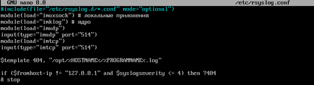
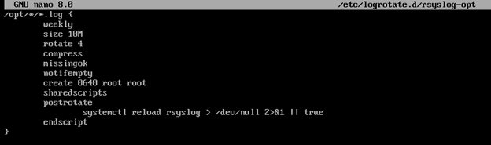
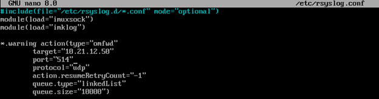

# SuroTools
> ⚙️ Проект находится на стадии активного развития.
> В начале представлены базовые настройки и примеры, которые со временем будут дополнены и расширены.

> Набор инструментов, конфигураций и документации для системных администраторов и инженеров Linux.  
> Цель проекта — создать единое место для хранения и автоматизации всех необходимых решений для Linux.

---

<details>
<summary>🐧 ALT Linux</summary>

<details>
<summary>🛠️🐧JEOS</summary>
    
После установки сего шедевра отечественного айти-прома первым делом нужно поставить нужные пакеты для комфортной работы - потому что даже автодополнение команд в этом дистрибутиве является опциональной, недостижимой мечтой, фичей уровня «Enterprise Deluxe Edition» :)))))

```bash
apt-get update
apt-get install bash-completion etcnet-full iptables nano 
```
    
</details>
    
<details>
<summary>🔀Настройка маршрутизации</summary>

<details>
<summary>ip_forward</summary>

net.ipv4.ip_forward позволяет системе работать как маршрутизатор - пересылать пакеты между сетевыми интерфейсами.

```bash
vim /etc/net/sysctl.conf
net.ipv4.ip_forward=1 #Меняем 0 на 1
vim /etc/sysctl.conf
net.ipv4.ip_forward=1
```

Перезагрузка sysctl

```bash
sysctl -p
```

</details>
    
<details>
<summary>iptables</summary>

iptables — это фаервол, который фильтрует и управляет сетевым трафиком на основе правил, решая, что пропустить, а что заблокировать.

Базовые команды iptables:

```bash
# Очистка старых правил
iptables -F
iptables -t nat -F
```

Сохранение настроек:

```bash
iptables-save >> /etc/sysconfig/iptables
systemctl enable iptables
```

Настройка правил на примере коммутатора:


```bash
iptables -t nat -A POSTROUTING -o <интерфейс с выходом на интернет> -j MASQUERADE
iptables -A	FORWARD	-i <интернет> -o <внут. инт> -j ACCEPT
iptables -A	FORWARD	-i <внут. инт> -o <интернет> -n state --state ESTABLISHED,RELATED -j ACCEPT
```

>iptables -t nat -A POSTROUTING -o <интерфейс с выходом на интернет> -j MASQUERADE - Прячет все внутренние компьютеры за своим внешним IP (Маскарадинг).
>
>iptables -A	FORWARD	-i <интернет> -o <внут. инт> -j ACCEPT - Позволяет внутренним компьютерам ходить в интернет.
>
>iptables -A	FORWARD	-i <внут. инт> -o <интернет> -n state --state ESTABLISHED,RELATED -j ACCEPT - Пропускает обратно только "ответы" на их запросы, повышая безопасность.

Настройка iptables после настройки DHCP

```bash
iptables -A INPUT -i <инт> -p udp -j ACCEPT
iptables -A INPUT -i <инт> -p tcp -j ACCEPT
iptables -A OUTPUT -i <инт> -p udp -j ACCEPT
iptables -A OUTPUT -i <инт> -p tcp -j ACCEPT
```

</details>

<details>
<summary>DHCP</summary>

Установка DHCP-сервера

```bash
apt-get install dhcp-server
```
Настройка /etc/dhcp/dhcpd.conf

```bash
default-lease-time 3600;
max-lease-time 86400;
authoritative;

subnet 10.21.211.0 netmask 255.255.255.0 {
    range 10.21.211.10 10.21.211.230;
    option routers 10.21.211.1;
    option subnet-mask 255.255.255.0;
    option broadcast-address 10.21.211.255;
}
```

> default-lease-time 3600; - время аренды по умолчанию (1 час)
>
> max-lease-time 86400; - максимальное время аренды (24 часа)
>
> authoritative; - сервер является авторитетным для данной сети
>
> subnet 10.21.211.0 netmask 255.255.255.0 - определение подсети
>
> range 10.21.211.10 10.21.211.230; - диапазон выдаваемых IP-адресов
>
> option routers 10.21.211.1; - шлюз по умолчанию
>
> option subnet-mask 255.255.255.0; - маска подсети
>
> option broadcast-address 10.21.211.255; - широковещательный адрес

Создание и настройка /etc/default/isc-dhcp-server

```bash
DHCP_CONF=/etc/dhcp/dhcpd.conf
DHCP_PID=/var/run/dhcpd.pid
DHCP_OPTS="-4"
INTERFACEv4="<ens34>"
INTERFACEv6=""
```

> DHCP_CONF=/etc/dhcp/dhcpd.conf - путь к основному конфигурационному файлу
>
> DHCP_PID=/var/run/dhcpd.pid - путь к файлу PID-процесса
>
> DHCP_OPTS="-4" - опции запуска (работа только с IPv4)
>
> INTERFACEv4="ens34" - интерфейс для IPv4
>
> INTERFACEv6="" - интерфейс для IPv6 (пусто - отключено)

Запускаем и добавляем в автозапуск dhcpd

```bash
systemctl start dhcpd && systemctl enable dhcpd
```

</details>
  
<details>
<summary>Статическая маршрутизация</summary>

### Настройка интерфейса

❗ Интерфесы в виратульную машину добавлять по одному! 

```bash
mkdir /etc/net/ifaces/ens34/
cp /etc/net/ifaces/ens33/options /etc/net/ifaces/ens34/
```
Если папка ifaces пустая, то берем конфиг options отсюда

```bash
BOOTPROTO=static
TYPE=eth
NM_CONTROLLED=no
DISABLED=no
CONFIG_WIRELESS=no
SYSTEMD_BOOTPROTO=dhcp4
CONFIG_IPV4=yes
SYSTEMD_CONTROLLED=no
ONBOOT=yes
CONFIG_IPV6=no
```
В конфигурации ipv4address пишите ip ❗❗❗ *с маской!!!* ❗❗❗

Поднимаем интерфейс

```bash
ifup ens34
```
Или перезапускаем network

```bash
systemctl restart network
```

### Настройка шлюза

```bash
vim /etc/net/ifaces/ens34/ipv4route
```

```bash
default via <ip роутера>
```

</details>

<details>
<summary>VLAN</summary>

Создаём каталог в интерфейсах

```bash
mkdir /etc/net/ifaces/ens33.XX # где XX - номер vlan
```

Создаем файлы ipv4address и options

```bash
touch /etc/net/ifaces/ens33.XX/ipv4address
touch /etc/net/ifaces/ens33.XX/options
```

Конфигурация options

```bash
TYPE=vlan
HOST=ens33
VID=XX
DISABLED=no
BOOTPROTO=static
```

В конфигурации ipv4address пишите ip ❗❗❗ *с маской!!!* ❗❗❗

</details>

</details>

<details>
<summary>📦 Установка и настройка ПО</summary>
    
<details>
<summary>Драйвера VMware</summary>

‼️ Без драйверов VMware вы не сможете копировать команды между вашим компьютером и виртуальной машиной!
    
```bash
apt-get install open-vm-tools open-vm-tools-desktop xrandr
systemctl enable vmtoolsd
systemctl start vmtoolsd
```
> open-vm-tools — базовые функции (общая папка, время, пр.)
>
> open-vm-tools-desktop — автоматическое разрешение экрана, мышь, графика
>
> xrandr — утилита для управления разрешением (на случай ручной настройки)
    
</details>

<details>
<summary>rsyslog</summary>

rsyslog — это система, которая собирает, фильтрует и перенаправляет логи (журналы событий) в нужные места.

Устанавливаем на клиент и на сервер

```bash
apt-get install rsyslog logrotate
```

# Настройка сервера

Настройка конфига в /etc/rsyslog.conf



```bash
#include(file="/etc/rsyslog.d/*.conf" mode="options1") 

module(load="imuxsock")
module(load="imklog")
module(load="imudp")
input(type="imudp" port="514")
module(load="imtcp")
input(type="imtcp" port="514")

$template 404, "/opt/%HOSTNAME%/%PROGRAMNAME%.log"

if ($fromhost-ip != "127.0.0.1" and $syslogseverity <= 4) then ?404
& stop 
```

>#include(file="/etc/rsyslog.d/*.conf" mode="optional")  - ЗАКОММЕНТИРОВАНО - подключение дополнительных конфигов
>
>module(load="imuxsock") - Загрузка модуля для Unix-сокетов (локальные приложения)
>
>module(load="imklog") - Загрузка модуля для логов ядра
>
>module(load="imudp") - Загрузка UDP-модуля
>
>input(type="imudp" port="514") - Прослушивание syslog-сообщений по UDP на порту 514
>
>module(load="imtcp") - Загрузка TCP-модуля
>
>input(type="imtcp" port="514") - Прослушивание syslog-сообщений по TCP на порту 514
>
>$template 404, "/opt/%HOSTNAME%/%PROGRAMNAME%.log" - Шаблон для именования файлов логов
>
>if ($fromhost-ip != "127.0.0.1" and $syslogseverity <= 4) then ?404 - Правило фильтрации: если IP отправителя не 127.0.0.1 и уровень серьезности <= 4 (warning)
>
>& stop - Остановка дальнейшей обработки для этих сообщений

P.S. 404 — это произвольное имя шаблона, как переменная.

Создание каталогов для сбора логов клиентских машин

```bash
mkdir -p /opt/cli1
mkdir -p /opt/cli2
mkdir -p /opt/cli3
```
logrotate — это утилита для автоматического управления лог-файлами: их ротации, сжатия, архивирования и удаления по заданным правилам.

Настройка logrotate в /etc/logrotate.d/rsyslog-opt



```bash
/opt/*/*.log {
    weekly
    size 10M
    rotate 4
    compress
    missingok
    notifempty
    create 0640 root root
    sharedscripts
    postrotate
        systemctl reload rsyslog > /dev/null 2>&1 || true
    endscript
}
```
>/opt/*/*.log {                    - Применять правила ко всем .log файлам в поддиректориях /opt/
>
>weekly                        - Ротация раз в неделю
>
>size 10M                      - Или при достижении размера файла 10 МБ
>
>rotate 4                      - Хранить 4 архивных копии логов
>
>compress                      - Сжимать архивные копии gzip
>
>missingok                     - Не считать ошибкой отсутствие файлов логов
>
>notifempty                    - Не ротировать пустые файлы
>
>create 0640 root root         - Создавать новый файл лога с правами 640, владелец root:root
>
>sharedscripts                 - Выполнять скрипты только один раз для всей группы файлов
>
>postrotate                    - Начало блока команд после ротации
>
>systemctl reload rsyslog > /dev/null 2>&1 || true  - Перезагрузка rsyslog, подавление вывода
>
>endscript                     - Конец блока команд
}

Включение автозапуска и немедленный запуск

```bash
systemctl enable --now rsyslog logrotate
```

---

# Настройка клиента

Настройка конфига в /etc/rsyslog.conf



```bash
*.warning action(type="omfwd"
    target="10.21.12.50"
    port="514"
    protocol="tcp"
    action.resumeRetryCount="-1"
    queue.type="linkedList"
    queue.size="10000")
```

>*.warning action(type="omfwd"    - Правило для всех сообщений с уровнем warning и выше
>
>target="10.21.12.50"         - Адрес удаленного syslog-сервера
>
>port="514"                   - Порт для отправки
>
>protocol="tcp"               - Использование TCP протокола
>
>action.resumeRetryCount="-1" - Бесконечные попытки переподключения при обрыве
>
>queue.type="linkedList"      - Тип очереди - связный список
>
>queue.size="10000")          - Максимальный размер очереди - 10000 сообщений

Включение автозапуска и немедленный запуск

```bash
systemctl enable --now rsyslog
```

</details>
    
</details>

</details>

---

<details>
<summary>🧊 Arch Linux</summary>

<details>
<summary>🛠️ Установка ОС</summary>

<details>
<summary>Перед установкой</summary>
    
Вот и настал тот самый день. День, когда вы решили, что жить спокойно — это не про вас, и поставили цель установить Arch Linux в качестве основной системы. 

Поздравляю! :)

Вы уже скачали образ, записали его на флешку, загрузились, и перед вами гордо мигает курсор в терминале. Момент истины настал.

Но… что дальше? 
Правильно! Сначала нужно убедиться, что интернет работает.

```bash
ping archlinux.org
```

Если вы на Wi-Fi, то пора приручить беспроводную сеть. Делается это просто (ну, относительно просто):

Проверка на блок Wi-Fi

```bash
rfkill
```

Если заблокирован - выполянем команду:

```bash
rfkill unblock wifi
```

### Подключение к Wi-Fi

```bash
iwctl
device list
station wlan0 scan
station wlan0 get-networks
station wlan0 connect <SSID>
```

Или можно сделать проще:

```bash
wifi-menu
```

</details>
    
<details>
<summary>1. Монтирование и разметка дисков</summary>
Для того, чтобы определять диски, используется команда <code>lsblk</code>
    
```bash
lsblk
```
Теперь нам нужно выбрать: GPT или MBR. Если у тебя ПК с UEFI - ставль GPT. 

А если стоит BIOS, - MBR

<details>
<summary>MBR</summary>

Разметка раздела

| Раздел | Название | Формат | Размер   | Назначение          |
|---------|-----------|---------|----------|----------------------|
| sdX1    | bios      | BIOS    | 1 MB    | Загрузочный BIOS     |
| sdX2    | boot      | EXT4    | 1 GB    | Ядра Linux           |
| sdX3    | swap      | SWAP    | 8 GB    | Раздел подкачки      |
| sdX4    | root      | EXT4   | Всё остальное | Система, данные      |


</details>

<details>
<summary>GPT</summary>

Разметка раздела

| Раздел | Название | Формат | Размер   | Назначение          |
|---------|-----------|---------|----------|----------------------|
| sdX1    | efi      | FAT32    | 300 MB    | Загрузочный BIOS     |
| sdX2    | boot      | EXT4    | 1 GB    | Ядра Linux           |
| sdX3    | swap      | SWAP    | 8 GB    | Раздел подкачки      |
| sdX4    | root      | EXT4   | Всё остальное | Система, данные      |

</details>

</details>

<details>
<summary>2. Установка ядра и базовая настройка</summary>
Пока пусто :(

</details>

<details>
<summary>3. GRUB</summary>


</details>

<details>
<summary>4. Установка графики</summary>
Пока пусто :(

</details>

<details>
<summary>Рекомендую к установке</summary>
Пока пусто :(

</details>

<details>
<summary>Путь самурая (для ленивых)</summary>
Пока пусто :(

</details>

</details>

</details>

---

<details>
<summary>🔄 CentOS</summary>

Пока пусто :(

</details>

---

<details>
<summary>🌿 EcoRouter</summary>

Пока пусто :(

</details>

---
## 💾 Образы ОС

JEOS ALT Linux - [Скачать](https://nightly.altlinux.org/sisyphus/tested/regular-jeos-systemd-latest-x86_64.iso)

---
## 📂Полезные штучки
<details>
<summary>Автоматизация настройки статики</summary>

<details>
<summary>ALT Linux</summary>


</details>

</details>

---

## 🧑‍💻 Автор

> Автор: **vanyadima**  
> Контакт: **isurodin@yandex.ru** **[VK](https://vk.com/surodyn)** **[Telegram](https://t.me/vanyadlma)**

## 💬 Благодарности

Особая благодарность **[Gerasti](https://github.com/Gerasti)** —  
за вдохновение и подход к организации проекта, которые послужили основой для создания SuroTools.
